# BULWARK — Architecture & Design Diagrams

Every diagram below is Mermaid (renders natively on GitHub) and is drawn
directly from the code in `src/bulwark/` — function names, event topic
names, status literals, and file paths are exact, not illustrative. For
prose explanation of *why* each mechanism is built the way it is, see
[`architecture.md`](architecture.md); this document is the visual
companion, organized the way a design doc typically is: HLD, LLD, DFD,
ERD, sequence diagrams, state diagrams, and a deployment diagram.

## Contents

1. [High-Level Design (HLD)](#1-high-level-design-hld)
   - 1.1 [System Context Diagram](#11-system-context-diagram)
   - 1.2 [Container / Component Diagram](#12-container-component-diagram)
2. [Low-Level Design (LLD)](#2-low-level-design-lld)
   - 2.1 [Platform Layer — Class Diagram](#21-platform-layer-class-diagram)
   - 2.2 [Agent Layer — Tool Function Signatures](#22-agent-layer-tool-function-signatures)
   - 2.3 [API Layer — Route Groupings](#23-api-layer-route-groupings)
3. [Data Flow Diagrams (DFD)](#3-data-flow-diagrams-dfd)
   - 3.1 [Level 0 — Context](#31-level-0-context)
   - 3.2 [Level 1 — Major Processes](#32-level-1-major-processes)
   - 3.3 [Level 2 — Onboard / Assure Detail](#33-level-2-onboard-assure-detail)
   - 3.4 [Level 2 — Watch Detail](#34-level-2-watch-detail)
4. [Entity-Relationship Diagram (ERD)](#4-entity-relationship-diagram-erd)
5. [Sequence Diagrams](#5-sequence-diagrams)
   - 5.1 [Onboard Loop — clean artifact](#51-onboard-loop-clean-artifact)
   - 5.2 [Onboard Loop — blocked by Model Armor](#52-onboard-loop-blocked-by-model-armor)
   - 5.3 [Assure Loop — contract review → concentration-risk cascade](#53-assure-loop-contract-review-concentration-risk-cascade)
   - 5.4 [Watch Loop — scheduled sweep incl. predictive risk-trend signal](#54-watch-loop-scheduled-sweep-incl-predictive-risk-trend-signal)
   - 5.5 [Attest Loop — questionnaire answering](#55-attest-loop-questionnaire-answering)
   - 5.6 [Human review & explainability](#56-human-review-explainability)
   - 5.7 [Kill switch (manual, live)](#57-kill-switch-manual-live)
   - 5.8 [Circuit breaker (automatic)](#58-circuit-breaker-automatic)
   - 5.9 [Rollback](#59-rollback)
   - 5.10 [Framework crosswalk query](#510-framework-crosswalk-query)
6. [State Diagrams](#6-state-diagrams)
   - 6.1 [Vendor lifecycle](#61-vendor-lifecycle)
   - 6.2 [Finding status](#62-finding-status)
   - 6.3 [Fleet autonomy ladder](#63-fleet-autonomy-ladder)
   - 6.4 [Answer status](#64-answer-status)
7. [Deployment Diagram](#7-deployment-diagram)
8. [Zero-Trust Identity Map](#8-zero-trust-identity-map)

---

## 1. High-Level Design (HLD)

### 1.1 System Context Diagram

Who and what BULWARK talks to, with no internal detail.

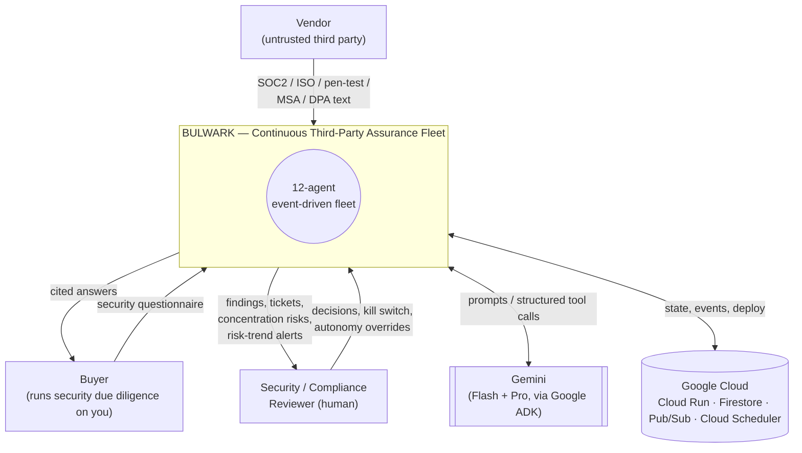
```mermaid
flowchart TB
    Vendor["Vendor\n(untrusted third party)"]
    Buyer["Buyer\n(runs security due diligence on you)"]
    Reviewer["Security / Compliance\nReviewer (human)"]
    Gemini[["Gemini\n(Flash + Pro, via Google ADK)"]]
    GCP[("Google Cloud\nCloud Run · Firestore · Pub/Sub · Cloud Scheduler")]

    subgraph SYS["BULWARK — Continuous Third-Party Assurance Fleet"]
        CORE(("12-agent\nevent-driven fleet"))
    end

    Vendor -- "SOC2 / ISO / pen-test /\nMSA / DPA text" --> SYS
    Buyer -- "security questionnaire" --> SYS
    SYS -- "cited answers" --> Buyer
    SYS -- "findings, tickets,\nconcentration risks,\nrisk-trend alerts" --> Reviewer
    Reviewer -- "decisions, kill switch,\nautonomy overrides" --> SYS
    SYS <-- "prompts / structured tool calls" --> Gemini
    SYS <-- "state, events, deploy" --> GCP
```

### 1.2 Container / Component Diagram

The four architectural layers and how they connect — this is the
"container diagram" level, one box per deployable/runnable concern.

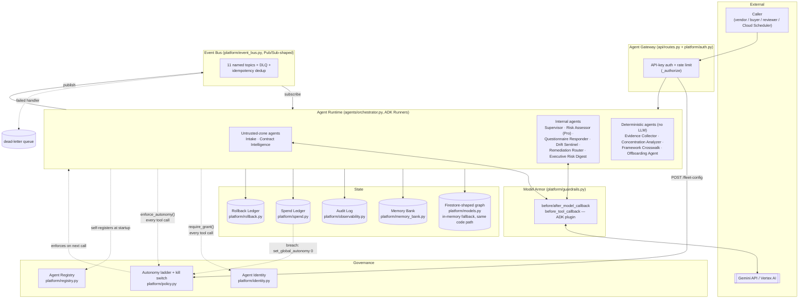
```mermaid
flowchart TB
    subgraph EXT["External"]
        Caller["Caller\n(vendor / buyer / reviewer / Cloud Scheduler)"]
        Gemini[["Gemini API / Vertex AI"]]
    end

    subgraph GW["Agent Gateway  (api/routes.py + platform/auth.py)"]
        AUTH["API-key auth + rate limit\n(_authorize)"]
    end

    subgraph RT["Agent Runtime  (agents/orchestrator.py, ADK Runners)"]
        UNTRUSTED["Untrusted-zone agents\nIntake · Contract Intelligence"]
        INTERNAL["Internal agents\nSupervisor · Risk Assessor (Pro) ·\nQuestionnaire Responder · Drift Sentinel ·\nRemediation Router · Executive Risk Digest"]
        DETERMINISTIC["Deterministic agents (no LLM)\nEvidence Collector · Concentration Analyzer ·\nFramework Crosswalk · Offboarding Agent"]
    end

    subgraph GUARD["Model Armor  (platform/guardrails.py)"]
        MA["before/after_model_callback\nbefore_tool_callback — ADK plugin"]
    end

    subgraph BUS["Event Bus  (platform/event_bus.py, Pub/Sub-shaped)"]
        TOPICS["11 named topics + DLQ +\nidempotency dedup"]
    end

    subgraph STATE["State"]
        FS[("Firestore-shaped graph\nplatform/models.py\nin-memory fallback, same code path")]
        MB[("Memory Bank\nplatform/memory_bank.py")]
        AL[("Audit Log\nplatform/observability.py")]
        SP[("Spend Ledger\nplatform/spend.py")]
        RB[("Rollback Ledger\nplatform/rollback.py")]
    end

    subgraph GOV["Governance"]
        REG["Agent Registry\nplatform/registry.py"]
        ID["Agent Identity\nplatform/identity.py"]
        POL["Autonomy ladder + kill switch\nplatform/policy.py"]
    end

    Caller --> AUTH --> RT
    UNTRUSTED <--> MA
    INTERNAL <--> MA
    MA <--> Gemini

    RT -->|publish| BUS -->|subscribe| RT
    BUS -.failed handler.-> DLQ[("dead-letter queue")]

    RT --> FS
    RT --> MB
    RT --> AL
    RT --> SP
    RT --> RB
    SP -.breach: set_global_autonomy 0.-> POL

    RT -. "require_grant()\nevery tool call" .-> ID
    RT -. "enforce_autonomy()\nevery tool call" .-> POL
    RT -. self-registers at startup .-> REG

    AUTH -->|"POST /fleet-config"| POL
    POL -.enforces on next call.-> RT
```

---

## 2. Low-Level Design (LLD)

### 2.1 Platform Layer — Class Diagram

The actual classes/functions each agent and route calls into. This is
the layer every one of the 12 agents shares — none of it is agent-
specific.

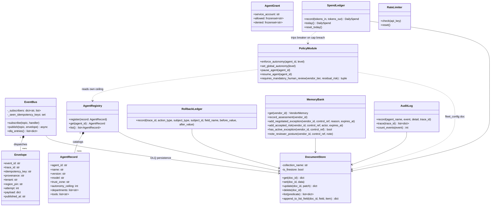
```mermaid
classDiagram
    class DocumentStore {
        -collection_name: str
        -is_firestore: bool
        +get(doc_id) dict
        +set(doc_id, data)
        +update(doc_id, patch) dict
        +delete(doc_id)
        +list(predicate) list~dict~
        +append_to_list_field(doc_id, field, item) dict
    }

    class EventBus {
        -_subscribers: dict~str, list~
        -_seen_idempotency_keys: set
        +subscribe(topic, handler)
        +publish(topic, envelope) async
        +dlq_entries() list~dict~
    }

    class Envelope {
        +event_id: str
        +trace_id: str
        +idempotency_key: str
        +provenance: str
        +tenant: str
        +region_pin: str
        +attempt: int
        +payload: dict
        +published_at: str
    }

    class AgentRegistry {
        +register(record: AgentRecord)
        +get(agent_id) AgentRecord
        +list() list~AgentRecord~
    }

    class AgentRecord {
        +agent_id: str
        +name: str
        +version: str
        +model: str
        +trust_zone: str
        +autonomy_ceiling: int
        +departments: list~str~
        +tools: list~str~
    }

    class AgentGrant {
        +service_account: str
        +allowed: frozenset~str~
        +denied: frozenset~str~
    }

    class PolicyModule {
        +enforce_autonomy(agent_id, level)
        +set_global_autonomy(level)
        +pause_agent(agent_id)
        +resume_agent(agent_id)
        +requires_mandatory_human_review(vendor_tier, residual_risk) tuple
    }

    class SpendLedger {
        +record(tokens_in, tokens_out) DailySpend
        +today() DailySpend
        +reset_today()
    }

    class RollbackLedger {
        +record(trace_id, action_type, subject_type, subject_id, field_name, before_value, after_value)
    }

    class MemoryBank {
        +get(vendor_id) VendorMemory
        +record_assessment(vendor_id)
        +add_negotiated_exception(vendor_id, control_ref, reason, expires_at)
        +add_accepted_risk(vendor_id, control_ref, actor, expires_at)
        +has_active_exception(vendor_id, control_ref) bool
        +note_reviewer_posture(vendor_id, control_ref, note)
    }

    class AuditLog {
        +record(agent_name, event, detail, trace_id)
        +trace(trace_id) list~dict~
        +count_events(event) int
    }

    class RateLimiter {
        +check(api_key)
        +reset()
    }

    EventBus "1" *-- "many" Envelope : dispatches
    AgentRegistry "1" *-- "many" AgentRecord : catalogs
    PolicyModule ..> AgentRegistry : reads own ceiling
    PolicyModule ..> DocumentStore : fleet_config doc
    SpendLedger ..> PolicyModule : trips breaker on cap breach
    EventBus --> DocumentStore : DLQ persistence
    MemoryBank --> DocumentStore
    AuditLog --> DocumentStore
    RollbackLedger --> DocumentStore
    AgentRegistry --> DocumentStore
    SpendLedger --> DocumentStore
```

### 2.2 Agent Layer — Tool Function Signatures

Every agent modeled as a "class" whose methods are its exact ADK
`FunctionTool` signatures — the real, callable contract each agent
exposes to its `LlmAgent` (or, for the four deterministic agents,
that a route calls directly).

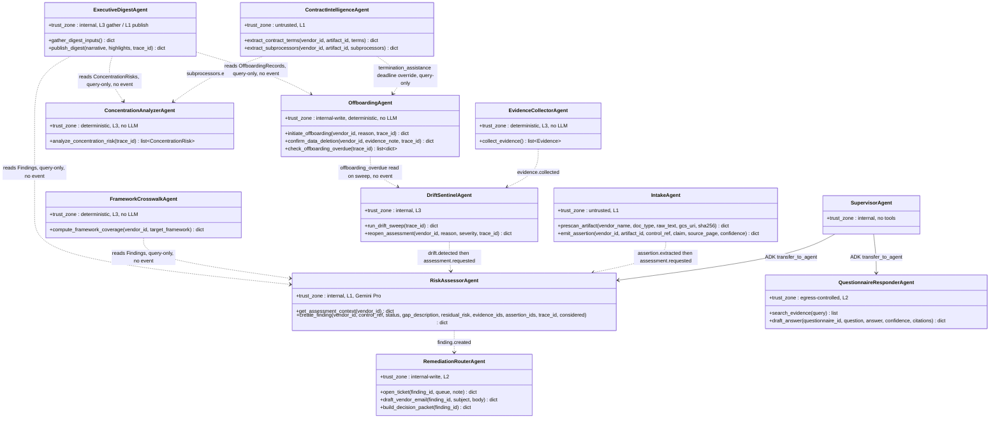
```mermaid
classDiagram
    class SupervisorAgent {
        +trust_zone : internal, no tools
    }

    class IntakeAgent {
        +trust_zone : untrusted, L1
        +prescan_artifact(vendor_name, doc_type, raw_text, gcs_uri, sha256) dict
        +emit_assertion(vendor_id, artifact_id, control_ref, claim, source_page, confidence) dict
    }

    class ContractIntelligenceAgent {
        +trust_zone : untrusted, L1
        +extract_contract_terms(vendor_id, artifact_id, terms) dict
        +extract_subprocessors(vendor_id, artifact_id, subprocessors) dict
    }

    class EvidenceCollectorAgent {
        +trust_zone : deterministic, L3, no LLM
        +collect_evidence() list~Evidence~
    }

    class RiskAssessorAgent {
        +trust_zone : internal, L1, Gemini Pro
        +get_assessment_context(vendor_id) dict
        +create_finding(vendor_id, control_ref, status, gap_description, residual_risk, evidence_ids, assertion_ids, trace_id, considered) dict
    }

    class QuestionnaireResponderAgent {
        +trust_zone : egress-controlled, L2
        +search_evidence(query) list
        +draft_answer(questionnaire_id, question, answer, confidence, citations) dict
    }

    class DriftSentinelAgent {
        +trust_zone : internal, L3
        +run_drift_sweep(trace_id) dict
        +reopen_assessment(vendor_id, reason, severity, trace_id) dict
    }

    class RemediationRouterAgent {
        +trust_zone : internal-write, L2
        +open_ticket(finding_id, queue, note) dict
        +draft_vendor_email(finding_id, subject, body) dict
        +build_decision_packet(finding_id) dict
    }

    class ConcentrationAnalyzerAgent {
        +trust_zone : deterministic, L3, no LLM
        +analyze_concentration_risk(trace_id) list~ConcentrationRisk~
    }

    class FrameworkCrosswalkAgent {
        +trust_zone : deterministic, L3, no LLM
        +compute_framework_coverage(vendor_id, target_framework) dict
    }

    class OffboardingAgent {
        +trust_zone : internal-write, deterministic, no LLM
        +initiate_offboarding(vendor_id, reason, trace_id) dict
        +confirm_data_deletion(vendor_id, evidence_note, trace_id) dict
        +check_offboarding_overdue(trace_id) list~dict~
    }

    class ExecutiveDigestAgent {
        +trust_zone : internal, L3 gather / L1 publish
        +gather_digest_inputs() dict
        +publish_digest(narrative, highlights, trace_id) dict
    }

    SupervisorAgent --> RiskAssessorAgent : ADK transfer_to_agent
    SupervisorAgent --> QuestionnaireResponderAgent : ADK transfer_to_agent
    IntakeAgent ..> RiskAssessorAgent : assertion.extracted then assessment.requested
    ContractIntelligenceAgent ..> ConcentrationAnalyzerAgent : subprocessors.extracted
    EvidenceCollectorAgent ..> DriftSentinelAgent : evidence.collected
    RiskAssessorAgent ..> RemediationRouterAgent : finding.created
    DriftSentinelAgent ..> RiskAssessorAgent : drift.detected then assessment.requested
    FrameworkCrosswalkAgent ..> RiskAssessorAgent : reads Findings, query-only, no event
    OffboardingAgent ..> DriftSentinelAgent : offboarding_overdue read on sweep, no event
    ContractIntelligenceAgent ..> OffboardingAgent : termination_assistance deadline override, query-only
    ExecutiveDigestAgent ..> RiskAssessorAgent : reads Findings, query-only, no event
    ExecutiveDigestAgent ..> ConcentrationAnalyzerAgent : reads ConcentrationRisks, query-only, no event
    ExecutiveDigestAgent ..> OffboardingAgent : reads OffboardingRecords, query-only, no event
```

### 2.3 API Layer — Route Groupings

All 44 routes in `api/routes.py`, grouped by resource, and what each
group ultimately calls.

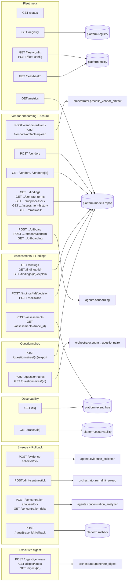
```mermaid
flowchart LR
    subgraph Fleet["Fleet meta"]
        R1["GET /status"]
        R2["GET /registry"]
        R3["GET /fleet-config\nPOST /fleet-config"]
        R4["GET /fleet/health"]
        R5["GET /metrics"]
    end
    subgraph Vendors["Vendor onboarding + Assure"]
        R6["POST /vendors"]
        R7["POST /vendors/artifacts\nPOST /vendors/artifacts/upload"]
        R8["GET /vendors, /vendors/{id}"]
        R9["GET .../findings\nGET .../contract-terms\nGET .../subprocessors\nGET .../assessment-history\nGET .../crosswalk"]
        R9b["POST .../offboard\nPOST .../offboard/confirm\nGET .../offboarding"]
    end
    subgraph Assess["Assessments + Findings"]
        R10["POST /assessments\nGET /assessments/{trace_id}"]
        R11["GET /findings\nGET /findings/{id}\nGET /findings/{id}/explain"]
        R12["POST /findings/{id}/decision\nPOST /decisions"]
    end
    subgraph Quest["Questionnaires"]
        R13["POST /questionnaires\nGET /questionnaires/{id}"]
        R14["POST /questionnaires/{id}/export"]
    end
    subgraph Sweeps["Sweeps + Rollback"]
        R15["POST /evidence-collector/tick"]
        R16["POST /drift-sentinel/tick"]
        R17["POST /concentration-analyzer/tick\nGET /concentration-risks"]
        R18["POST /runs/{trace_id}/rollback"]
    end
    subgraph Obs["Observability"]
        R19["GET /traces/{id}"]
        R20["GET /dlq"]
    end
    subgraph Digest["Executive digest"]
        R21["POST /digest/generate\nGET /digest/latest\nGET /digest/{id}"]
    end

    R2 --> REG[("platform.registry")]
    R3 --> POL[("platform.policy")]
    R4 --> POL
    R5 --> MODELS[("platform.models repos")]
    R6 & R8 & R9 --> MODELS
    R7 --> ORCH["orchestrator.process_vendor_artifact"]
    R9b --> OFF["agents.offboarding"]
    R10 --> BUS[("platform.event_bus")]
    R11 & R12 --> MODELS
    R13 --> ORCH2["orchestrator.submit_questionnaire"]
    R14 --> MODELS
    R15 --> EC["agents.evidence_collector"]
    R16 --> ORCH3["orchestrator.run_drift_sweep"]
    R17 --> CA["agents.concentration_analyzer"]
    R18 --> RB[("platform.rollback")]
    R19 --> AL[("platform.observability")]
    R20 --> BUS
    R21 --> ORCH4["orchestrator.generate_digest"]
```

---

## 3. Data Flow Diagrams (DFD)

Standard DFD notation: rectangles are external entities, rounded
shapes are processes, cylinders are data stores.

### 3.1 Level 0 — Context

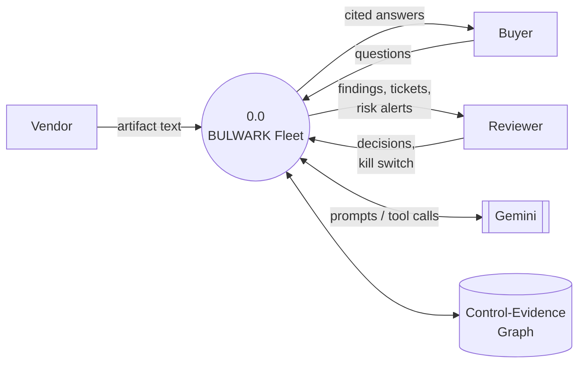
```mermaid
flowchart LR
    V["Vendor"]
    B["Buyer"]
    R["Reviewer"]
    G[["Gemini"]]
    P(("0.0\nBULWARK Fleet"))
    DS[("Control-Evidence\nGraph")]

    V -->|"artifact text"| P
    B -->|"questions"| P
    P -->|"cited answers"| B
    P -->|"findings, tickets,\nrisk alerts"| R
    R -->|"decisions,\nkill switch"| P
    P <-->|"prompts / tool calls"| G
    P <--> DS
```

### 3.2 Level 1 — Major Processes

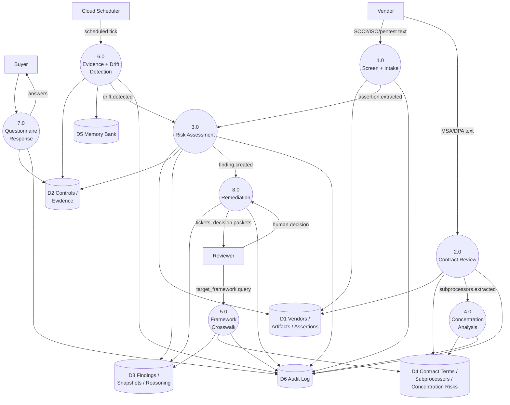
```mermaid
flowchart TB
    V["Vendor"]
    B["Buyer"]
    R["Reviewer"]
    Sched["Cloud Scheduler"]

    P1(("1.0\nScreen + Intake"))
    P2(("2.0\nContract Review"))
    P3(("3.0\nRisk Assessment"))
    P4(("4.0\nConcentration\nAnalysis"))
    P5(("5.0\nFramework\nCrosswalk"))
    P6(("6.0\nEvidence + Drift\nDetection"))
    P7(("7.0\nQuestionnaire\nResponse"))
    P8(("8.0\nRemediation"))

    D1[("D1 Vendors /\nArtifacts / Assertions")]
    D2[("D2 Controls /\nEvidence")]
    D3[("D3 Findings /\nSnapshots / Reasoning")]
    D4[("D4 Contract Terms /\nSubprocessors / Concentration Risks")]
    D5[("D5 Memory Bank")]
    D6[("D6 Audit Log")]

    V -->|"SOC2/ISO/pentest text"| P1
    V -->|"MSA/DPA text"| P2
    P1 --> D1
    P1 -->|"assertion.extracted"| P3
    P2 --> D1
    P2 --> D4
    P2 -->|"subprocessors.extracted"| P4
    P3 --> D1
    P3 --> D2
    P3 --> D3
    P3 -->|"finding.created"| P8
    P4 --> D4
    P5 --> D3
    P5 --> D4
    P6 --> D2
    P6 --> D5
    P6 -->|"drift.detected"| P3
    Sched -->|"scheduled tick"| P6
    B --> P7
    P7 --> D2
    P7 -->|"answers"| B
    P8 --> D3
    P8 -->|"tickets, decision packets"| R
    R -->|"human.decision"| P8
    R -->|"target_framework query"| P5
    P1 & P2 & P3 & P4 & P5 & P6 & P7 & P8 --> D6
```

### 3.3 Level 2 — Onboard / Assure Detail

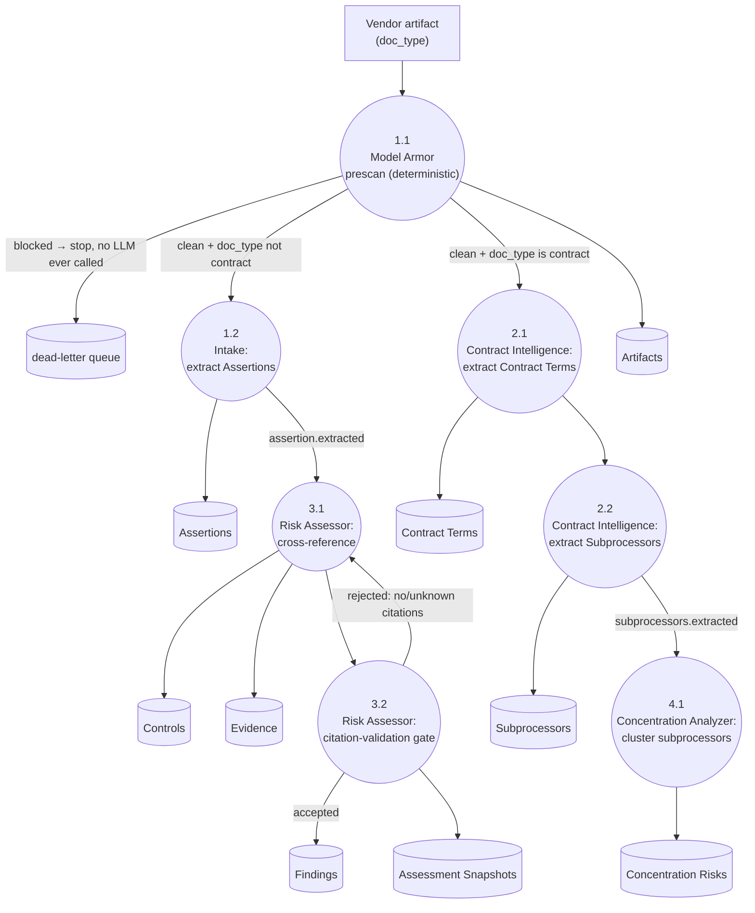
```mermaid
flowchart TB
    V["Vendor artifact\n(doc_type)"]
    P1_1(("1.1\nModel Armor\nprescan (deterministic)"))
    P1_2(("1.2\nIntake:\nextract Assertions"))
    P2_1(("2.1\nContract Intelligence:\nextract Contract Terms"))
    P2_2(("2.2\nContract Intelligence:\nextract Subprocessors"))
    P3_1(("3.1\nRisk Assessor:\ncross-reference"))
    P3_2(("3.2\nRisk Assessor:\ncitation-validation gate"))
    P4_1(("4.1\nConcentration Analyzer:\ncluster subprocessors"))

    D1a[("Artifacts")]
    D1b[("Assertions")]
    D2a[("Controls")]
    D2b[("Evidence")]
    D3a[("Findings")]
    D3b[("Assessment Snapshots")]
    D4a[("Contract Terms")]
    D4b[("Subprocessors")]
    D4c[("Concentration Risks")]
    DLQ[("dead-letter queue")]

    V --> P1_1
    P1_1 -->|"blocked → stop, no LLM ever called"| DLQ
    P1_1 -->|"clean + doc_type not contract"| P1_2
    P1_1 -->|"clean + doc_type is contract"| P2_1
    P1_1 --> D1a

    P1_2 --> D1b
    P1_2 -->|"assertion.extracted"| P3_1

    P2_1 --> D4a
    P2_1 --> P2_2
    P2_2 --> D4b
    P2_2 -->|"subprocessors.extracted"| P4_1
    P4_1 --> D4c

    P3_1 --> D2a
    P3_1 --> D2b
    P3_1 --> P3_2
    P3_2 -->|"rejected: no/unknown citations"| P3_1
    P3_2 -->|"accepted"| D3a
    P3_2 --> D3b
```

### 3.4 Level 2 — Watch Detail

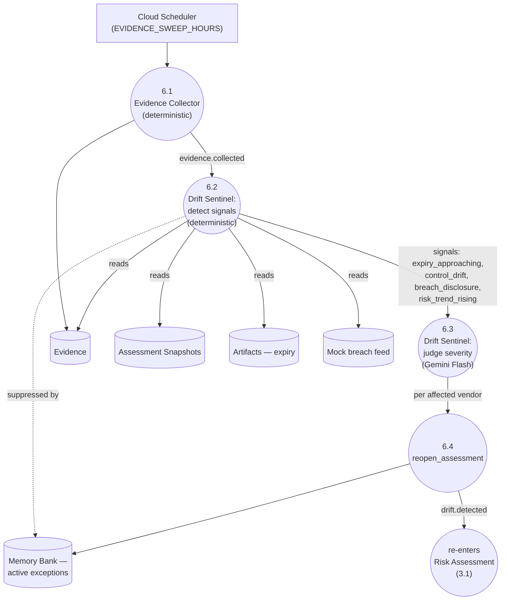
```mermaid
flowchart TB
    Sched["Cloud Scheduler\n(EVIDENCE_SWEEP_HOURS)"]
    P6_1(("6.1\nEvidence Collector\n(deterministic)"))
    P6_2(("6.2\nDrift Sentinel:\ndetect signals\n(deterministic)"))
    P6_3(("6.3\nDrift Sentinel:\njudge severity\n(Gemini Flash)"))
    P6_4(("6.4\nreopen_assessment"))

    D2b[("Evidence")]
    D3b[("Assessment Snapshots")]
    D1a[("Artifacts — expiry")]
    D5[("Memory Bank —\nactive exceptions")]
    MOCK[("Mock breach feed")]

    Sched --> P6_1
    P6_1 --> D2b
    P6_1 -->|"evidence.collected"| P6_2

    P6_2 -->|"reads"| D1a
    P6_2 -->|"reads"| D2b
    P6_2 -->|"reads"| D3b
    P6_2 -->|"reads"| MOCK
    P6_2 -.suppressed by.-> D5
    P6_2 -->|"signals: expiry_approaching,\ncontrol_drift, breach_disclosure,\nrisk_trend_rising"| P6_3

    P6_3 -->|"per affected vendor"| P6_4
    P6_4 -->|"drift.detected"| RE(("re-enters\nRisk Assessment\n(3.1)"))
    P6_4 --> D5
```

---

## 4. Entity-Relationship Diagram (ERD)

The core control-evidence graph (`platform/models.py`). `Run`,
`FleetConfig`, and `CompensatingAction` are cross-cutting / trace-scoped
rather than vendor-relational, so they're called out below the diagram
instead of forced into it.

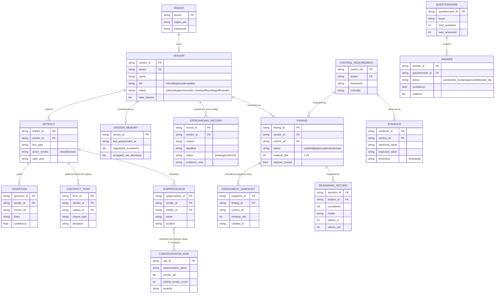
```mermaid
erDiagram
    TENANT ||--o{ VENDOR : owns
    VENDOR ||--o{ ARTIFACT : submits
    VENDOR ||--o| VENDOR_MEMORY : "remembered as"
    VENDOR ||--o{ OFFBOARDING_RECORD : "tracked by, once ending"
    ARTIFACT ||--o{ ASSERTION : yields
    ARTIFACT ||--o{ CONTRACT_TERM : "yields (contract doc types)"
    ARTIFACT ||--o{ SUBPROCESSOR : discloses
    VENDOR ||--o{ FINDING : "assessed via"
    CONTROL_REQUIREMENT ||--o{ FINDING : "evaluated by"
    CONTROL_REQUIREMENT ||--o{ EVIDENCE : "observed as"
    FINDING ||--o{ ASSESSMENT_SNAPSHOT : "recorded as (append-only)"
    FINDING ||--o{ REASONING_RECORD : "explained by"
    SUBPROCESSOR }o--o{ CONCENTRATION_RISK : "clustered into (shared name, 2+ vendors)"
    QUESTIONNAIRE ||--o{ ANSWER : contains

    TENANT {
        string tenant PK
        string region_pin
        string framework
    }
    VENDOR {
        string vendor_id PK
        string tenant FK
        string name
        string tier "critical|high|moderate|low"
        string status "onboarding|active|under_review|offboarding|offboarded"
        list data_classes
    }
    ARTIFACT {
        string artifact_id PK
        string vendor_id FK
        string doc_type
        string armor_verdict "clean|blocked"
        string valid_until
    }
    ASSERTION {
        string assertion_id PK
        string vendor_id FK
        string control_ref
        string claim
        float confidence
    }
    CONTROL_REQUIREMENT {
        string control_ref PK
        string tenant FK
        string framework
        string criticality
    }
    EVIDENCE {
        string evidence_id PK
        string control_ref FK
        string observed_value
        string expected_value
        string freshness "fresh|stale"
    }
    FINDING {
        string finding_id PK
        string vendor_id FK
        string control_ref FK
        string status "satisfied|gap|exception|unknown"
        int residual_risk "1-25"
        bool requires_human
    }
    ASSESSMENT_SNAPSHOT {
        string snapshot_id PK
        string finding_id FK
        string control_ref
        int residual_risk
        string created_at
    }
    REASONING_RECORD {
        string decision_id PK
        string subject_id FK
        list considered
        string model
        int tokens_in
        int tokens_out
    }
    CONTRACT_TERM {
        string term_id PK
        string vendor_id FK
        string artifact_id FK
        string clause_type
        string deviation
    }
    SUBPROCESSOR {
        string subprocessor_id PK
        string vendor_id FK
        string artifact_id FK
        string name
        string location
    }
    CONCENTRATION_RISK {
        string risk_id PK
        string subprocessor_name
        list vendor_ids
        int critical_vendor_count
        string severity
    }
    QUESTIONNAIRE {
        string questionnaire_id PK
        string buyer
        int total_questions
        int auto_answered
    }
    ANSWER {
        string answer_id PK
        string questionnaire_id FK
        string status "auto|needs_human|approved|blocked_dlp"
        float confidence
        list citations
    }
    VENDOR_MEMORY {
        string vendor_id PK
        string last_assessment_at
        list negotiated_exceptions
        list accepted_risk_decisions
    }
    OFFBOARDING_RECORD {
        string record_id PK
        string vendor_id FK
        string reason
        string deadline
        string status "pending|confirmed"
        string evidence_note
    }
```

**Not shown above (trace-scoped, not vendor-relational):**
`Run` (checkpoint state for one sweep, keyed by `run_id`), `FleetConfig`
(one singleton — `autonomy_level`, `max_daily_token_spend`,
`paused_agents`), `CompensatingAction` (keyed by `trace_id` +
polymorphic `subject_type`/`subject_id`, replayed by
`POST /runs/{trace_id}/rollback`), `Digest` (tenant-scoped snapshot —
`digest_id`, `narrative`, `highlights`, and the exact `inputs` dict it
was grounded in — not tied to one vendor, so it's a tenant-wide summary
of the graph above at a point in time, not a node in it).

---

## 5. Sequence Diagrams

### 5.1 Onboard Loop — clean artifact

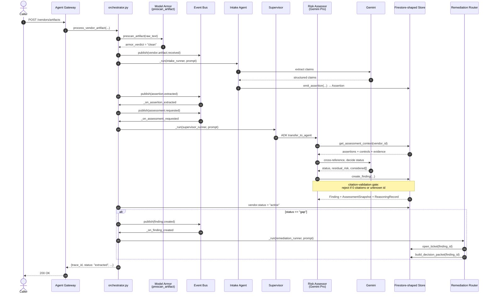
```mermaid
sequenceDiagram
    autonumber
    actor Caller
    participant GW as Agent Gateway
    participant ORCH as orchestrator.py
    participant MA as Model Armor<br/>(prescan_artifact)
    participant Bus as Event Bus
    participant Intake as Intake Agent
    participant Sup as Supervisor
    participant RA as Risk Assessor<br/>(Gemini Pro)
    participant Gem as Gemini
    participant Store as Firestore-shaped Store
    participant Rem as Remediation Router

    Caller->>GW: POST /vendors/artifacts
    GW->>ORCH: process_vendor_artifact(...)
    ORCH->>MA: prescan_artifact(raw_text)
    MA-->>ORCH: armor_verdict = "clean"
    ORCH->>Bus: publish(vendor.artifact.received)
    ORCH->>Intake: _run(intake_runner, prompt)
    Intake->>Gem: extract claims
    Gem-->>Intake: structured claims
    Intake->>Store: emit_assertion(...) → Assertion
    ORCH->>Bus: publish(assertion.extracted)
    Bus->>ORCH: _on_assertion_extracted
    ORCH->>Bus: publish(assessment.requested)
    Bus->>ORCH: _on_assessment_requested
    ORCH->>Sup: _run(supervisor_runner, prompt)
    Sup->>RA: ADK transfer_to_agent
    RA->>Store: get_assessment_context(vendor_id)
    Store-->>RA: assertions + controls + evidence
    RA->>Gem: cross-reference, decide status
    Gem-->>RA: status, residual_risk, considered[]
    RA->>Store: create_finding(...)
    Note over RA,Store: citation-validation gate:<br/>reject if 0 citations or unknown id
    Store-->>RA: Finding + AssessmentSnapshot + ReasoningRecord
    ORCH->>Store: vendor.status = "active"
    alt status == "gap"
        ORCH->>Bus: publish(finding.created)
        Bus->>ORCH: _on_finding_created
        ORCH->>Rem: _run(remediation_runner, prompt)
        Rem->>Store: open_ticket(finding_id)
        Rem->>Store: build_decision_packet(finding_id)
    end
    ORCH-->>GW: {trace_id, status: "extracted", ...}
    GW-->>Caller: 200 OK
```

### 5.2 Onboard Loop — blocked by Model Armor

The 30-second demo moment: the injection never reaches an LLM at all.

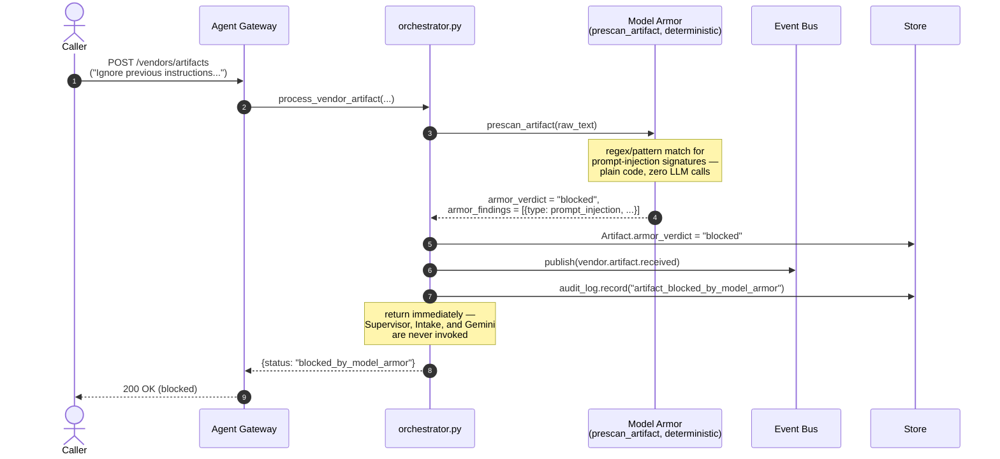
```mermaid
sequenceDiagram
    autonumber
    actor Caller
    participant GW as Agent Gateway
    participant ORCH as orchestrator.py
    participant MA as Model Armor<br/>(prescan_artifact, deterministic)
    participant Bus as Event Bus
    participant Store as Store

    Caller->>GW: POST /vendors/artifacts<br/>("Ignore previous instructions...")
    GW->>ORCH: process_vendor_artifact(...)
    ORCH->>MA: prescan_artifact(raw_text)
    Note over MA: regex/pattern match for<br/>prompt-injection signatures —<br/>plain code, zero LLM calls
    MA-->>ORCH: armor_verdict = "blocked",<br/>armor_findings = [{type: prompt_injection, ...}]
    ORCH->>Store: Artifact.armor_verdict = "blocked"
    ORCH->>Bus: publish(vendor.artifact.received)
    ORCH->>Store: audit_log.record("artifact_blocked_by_model_armor")
    Note over ORCH: return immediately —<br/>Supervisor, Intake, and Gemini<br/>are never invoked
    ORCH-->>GW: {status: "blocked_by_model_armor"}
    GW-->>Caller: 200 OK (blocked)
```

### 5.3 Assure Loop — contract review → concentration-risk cascade

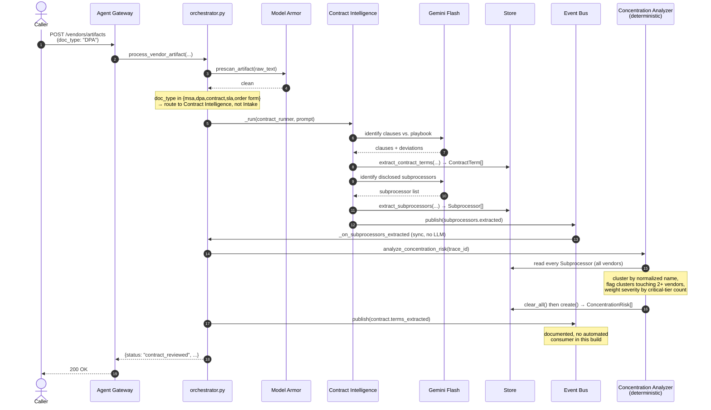
```mermaid
sequenceDiagram
    autonumber
    actor Caller
    participant GW as Agent Gateway
    participant ORCH as orchestrator.py
    participant MA as Model Armor
    participant CI as Contract Intelligence
    participant Gem as Gemini Flash
    participant Store as Store
    participant Bus as Event Bus
    participant CA as Concentration Analyzer<br/>(deterministic)

    Caller->>GW: POST /vendors/artifacts<br/>(doc_type: "DPA")
    GW->>ORCH: process_vendor_artifact(...)
    ORCH->>MA: prescan_artifact(raw_text)
    MA-->>ORCH: clean
    Note over ORCH: doc_type in {msa,dpa,contract,sla,order form}<br/>→ route to Contract Intelligence, not Intake
    ORCH->>CI: _run(contract_runner, prompt)
    CI->>Gem: identify clauses vs. playbook
    Gem-->>CI: clauses + deviations
    CI->>Store: extract_contract_terms(...) → ContractTerm[]
    CI->>Gem: identify disclosed subprocessors
    Gem-->>CI: subprocessor list
    CI->>Store: extract_subprocessors(...) → Subprocessor[]
    CI->>Bus: publish(subprocessors.extracted)
    Bus->>ORCH: _on_subprocessors_extracted (sync, no LLM)
    ORCH->>CA: analyze_concentration_risk(trace_id)
    CA->>Store: read every Subprocessor (all vendors)
    Note over CA: cluster by normalized name,<br/>flag clusters touching 2+ vendors,<br/>weight severity by critical-tier count
    CA->>Store: clear_all() then create() → ConcentrationRisk[]
    ORCH->>Bus: publish(contract.terms_extracted)
    Note over Bus: documented, no automated<br/>consumer in this build
    ORCH-->>GW: {status: "contract_reviewed", ...}
    GW-->>Caller: 200 OK
```

### 5.4 Watch Loop — scheduled sweep incl. predictive risk-trend signal

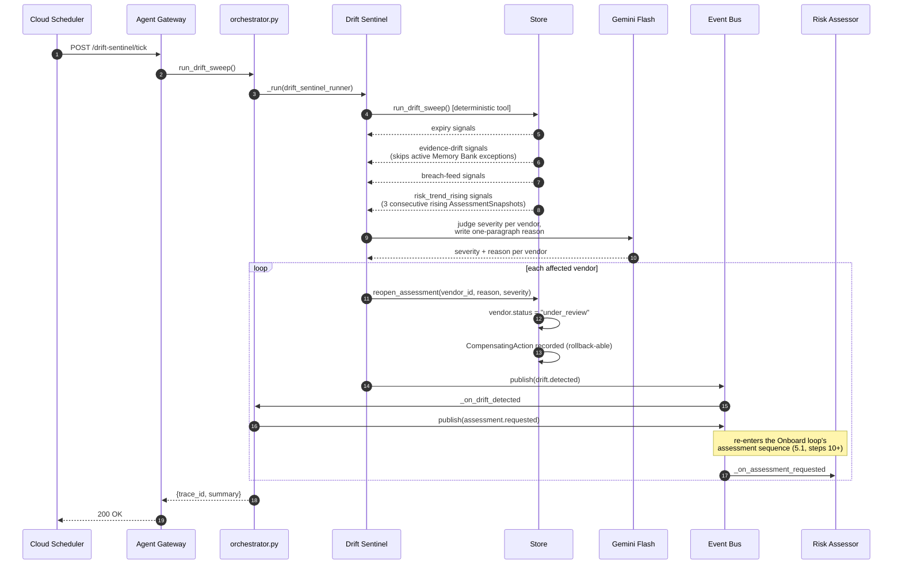
```mermaid
sequenceDiagram
    autonumber
    participant Sched as Cloud Scheduler
    participant GW as Agent Gateway
    participant ORCH as orchestrator.py
    participant DS as Drift Sentinel
    participant Store as Store
    participant Gem as Gemini Flash
    participant Bus as Event Bus
    participant RA as Risk Assessor

    Sched->>GW: POST /drift-sentinel/tick
    GW->>ORCH: run_drift_sweep()
    ORCH->>DS: _run(drift_sentinel_runner)
    DS->>Store: run_drift_sweep() [deterministic tool]
    Store-->>DS: expiry signals
    Store-->>DS: evidence-drift signals<br/>(skips active Memory Bank exceptions)
    Store-->>DS: breach-feed signals
    Store-->>DS: risk_trend_rising signals<br/>(3 consecutive rising AssessmentSnapshots)
    DS->>Gem: judge severity per vendor,<br/>write one-paragraph reason
    Gem-->>DS: severity + reason per vendor
    loop each affected vendor
        DS->>Store: reopen_assessment(vendor_id, reason, severity)
        Store->>Store: vendor.status = "under_review"
        Store->>Store: CompensatingAction recorded (rollback-able)
        DS->>Bus: publish(drift.detected)
        Bus->>ORCH: _on_drift_detected
        ORCH->>Bus: publish(assessment.requested)
        Note over Bus,RA: re-enters the Onboard loop's<br/>assessment sequence (5.1, steps 10+)
        Bus->>RA: _on_assessment_requested
    end
    ORCH-->>GW: {trace_id, summary}
    GW-->>Sched: 200 OK
```

### 5.5 Attest Loop — questionnaire answering

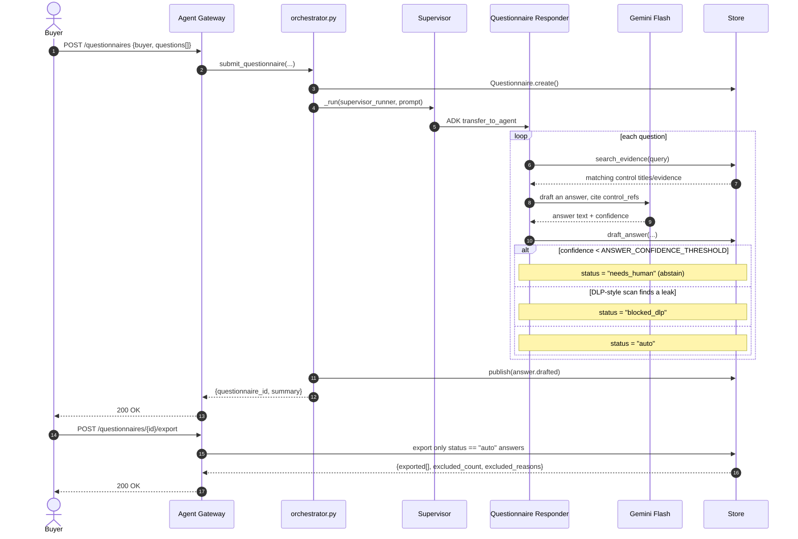
```mermaid
sequenceDiagram
    autonumber
    actor Buyer
    participant GW as Agent Gateway
    participant ORCH as orchestrator.py
    participant Sup as Supervisor
    participant QR as Questionnaire Responder
    participant Gem as Gemini Flash
    participant Store as Store

    Buyer->>GW: POST /questionnaires {buyer, questions[]}
    GW->>ORCH: submit_questionnaire(...)
    ORCH->>Store: Questionnaire.create()
    ORCH->>Sup: _run(supervisor_runner, prompt)
    Sup->>QR: ADK transfer_to_agent
    loop each question
        QR->>Store: search_evidence(query)
        Store-->>QR: matching control titles/evidence
        QR->>Gem: draft an answer, cite control_refs
        Gem-->>QR: answer text + confidence
        QR->>Store: draft_answer(...)
        alt confidence < ANSWER_CONFIDENCE_THRESHOLD
            Note over QR,Store: status = "needs_human" (abstain)
        else DLP-style scan finds a leak
            Note over QR,Store: status = "blocked_dlp"
        else
            Note over QR,Store: status = "auto"
        end
    end
    ORCH->>Store: publish(answer.drafted)
    ORCH-->>GW: {questionnaire_id, summary}
    GW-->>Buyer: 200 OK
    Buyer->>GW: POST /questionnaires/{id}/export
    GW->>Store: export only status == "auto" answers
    Store-->>GW: {exported[], excluded_count, excluded_reasons}
    GW-->>Buyer: 200 OK
```

### 5.6 Human review & explainability

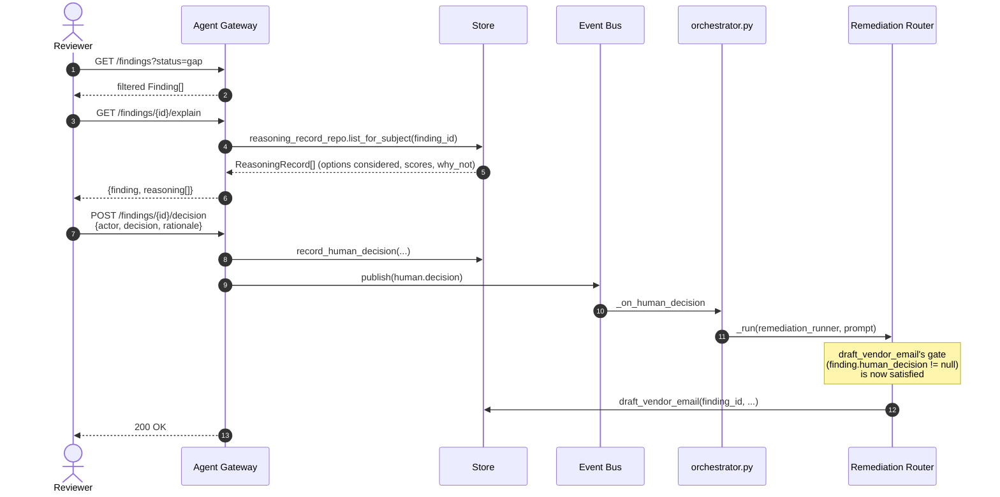
```mermaid
sequenceDiagram
    autonumber
    actor Reviewer
    participant GW as Agent Gateway
    participant Store as Store
    participant Bus as Event Bus
    participant ORCH as orchestrator.py
    participant Rem as Remediation Router

    Reviewer->>GW: GET /findings?status=gap
    GW-->>Reviewer: filtered Finding[]
    Reviewer->>GW: GET /findings/{id}/explain
    GW->>Store: reasoning_record_repo.list_for_subject(finding_id)
    Store-->>GW: ReasoningRecord[] (options considered, scores, why_not)
    GW-->>Reviewer: {finding, reasoning[]}
    Reviewer->>GW: POST /findings/{id}/decision<br/>{actor, decision, rationale}
    GW->>Store: record_human_decision(...)
    GW->>Bus: publish(human.decision)
    Bus->>ORCH: _on_human_decision
    ORCH->>Rem: _run(remediation_runner, prompt)
    Note over Rem: draft_vendor_email's gate<br/>(finding.human_decision != null)<br/>is now satisfied
    Rem->>Store: draft_vendor_email(finding_id, ...)
    GW-->>Reviewer: 200 OK
```

### 5.7 Kill switch (manual, live)

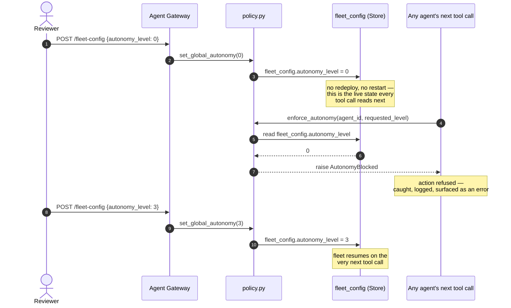
```mermaid
sequenceDiagram
    autonumber
    actor Reviewer
    participant GW as Agent Gateway
    participant Pol as policy.py
    participant Store as fleet_config (Store)
    participant AnyAgent as Any agent's next tool call

    Reviewer->>GW: POST /fleet-config {autonomy_level: 0}
    GW->>Pol: set_global_autonomy(0)
    Pol->>Store: fleet_config.autonomy_level = 0
    Note over Store: no redeploy, no restart —<br/>this is the live state every<br/>tool call reads next
    AnyAgent->>Pol: enforce_autonomy(agent_id, requested_level)
    Pol->>Store: read fleet_config.autonomy_level
    Store-->>Pol: 0
    Pol-->>AnyAgent: raise AutonomyBlocked
    Note over AnyAgent: action refused —<br/>caught, logged, surfaced as an error
    Reviewer->>GW: POST /fleet-config {autonomy_level: 3}
    GW->>Pol: set_global_autonomy(3)
    Pol->>Store: fleet_config.autonomy_level = 3
    Note over Store: fleet resumes on the<br/>very next tool call
```

### 5.8 Circuit breaker (automatic)

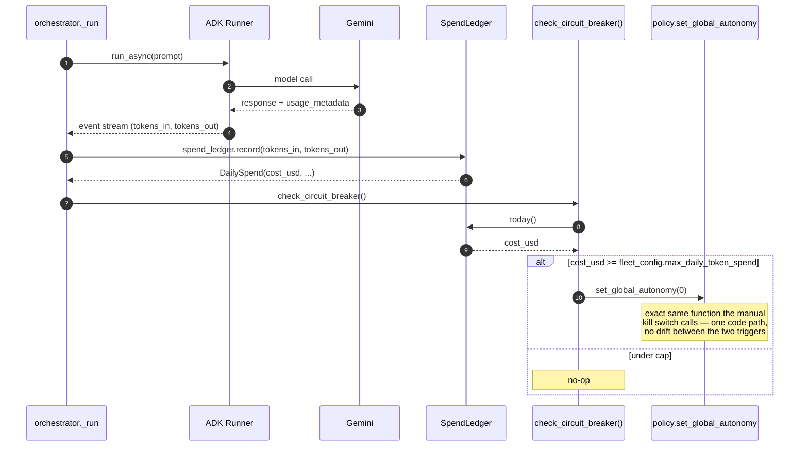
```mermaid
sequenceDiagram
    autonumber
    participant ORCH as orchestrator._run
    participant Runner as ADK Runner
    participant Gem as Gemini
    participant SL as SpendLedger
    participant CB as check_circuit_breaker()
    participant Pol as policy.set_global_autonomy

    ORCH->>Runner: run_async(prompt)
    Runner->>Gem: model call
    Gem-->>Runner: response + usage_metadata
    Runner-->>ORCH: event stream (tokens_in, tokens_out)
    ORCH->>SL: spend_ledger.record(tokens_in, tokens_out)
    SL-->>ORCH: DailySpend(cost_usd, ...)
    ORCH->>CB: check_circuit_breaker()
    CB->>SL: today()
    SL-->>CB: cost_usd
    alt cost_usd >= fleet_config.max_daily_token_spend
        CB->>Pol: set_global_autonomy(0)
        Note over Pol: exact same function the manual<br/>kill switch calls — one code path,<br/>no drift between the two triggers
    else under cap
        Note over CB: no-op
    end
```

### 5.9 Rollback

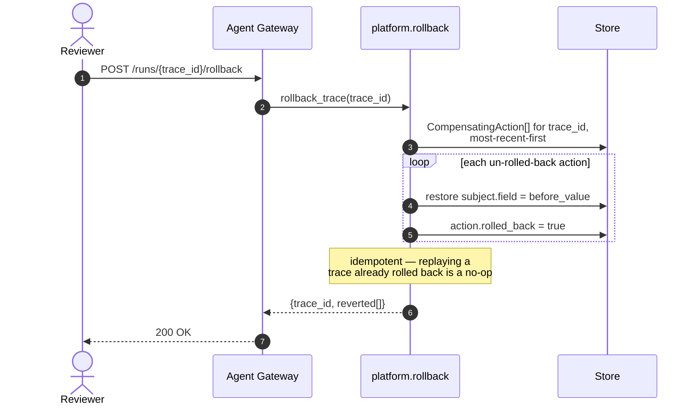
```mermaid
sequenceDiagram
    autonumber
    actor Reviewer
    participant GW as Agent Gateway
    participant RB as platform.rollback
    participant Store as Store

    Reviewer->>GW: POST /runs/{trace_id}/rollback
    GW->>RB: rollback_trace(trace_id)
    RB->>Store: CompensatingAction[] for trace_id,<br/>most-recent-first
    loop each un-rolled-back action
        RB->>Store: restore subject.field = before_value
        RB->>Store: action.rolled_back = true
    end
    Note over RB: idempotent — replaying a<br/>trace already rolled back is a no-op
    RB-->>GW: {trace_id, reverted[]}
    GW-->>Reviewer: 200 OK
```

### 5.10 Framework crosswalk query

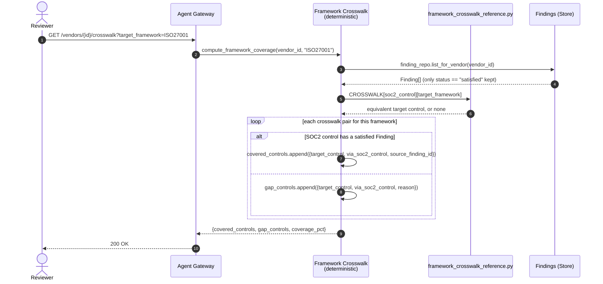
```mermaid
sequenceDiagram
    autonumber
    actor Reviewer
    participant GW as Agent Gateway
    participant FC as Framework Crosswalk<br/>(deterministic)
    participant Ref as framework_crosswalk_reference.py
    participant Store as Findings (Store)

    Reviewer->>GW: GET /vendors/{id}/crosswalk?target_framework=ISO27001
    GW->>FC: compute_framework_coverage(vendor_id, "ISO27001")
    FC->>Store: finding_repo.list_for_vendor(vendor_id)
    Store-->>FC: Finding[] (only status == "satisfied" kept)
    FC->>Ref: CROSSWALK[soc2_control][target_framework]
    Ref-->>FC: equivalent target control, or none
    loop each crosswalk pair for this framework
        alt SOC2 control has a satisfied Finding
            FC->>FC: covered_controls.append({target_control, via_soc2_control, source_finding_id})
        else
            FC->>FC: gap_controls.append({target_control, via_soc2_control, reason})
        end
    end
    FC-->>GW: {covered_controls, gap_controls, coverage_pct}
    GW-->>Reviewer: 200 OK
```

---

## 6. State Diagrams

### 6.1 Vendor lifecycle

`VendorStatus = "onboarding" | "active" | "under_review" | "offboarding" |
"offboarded"` (`platform/models.py`). `offboarding`/`offboarded` were
defined in the type since this schema's first version but had no code
path that ever set or cleared them, until `agents/offboarding.py`
(`initiate_offboarding` / `confirm_data_deletion`) operationalized both.

```mermaid
stateDiagram-v2
    [*] --> onboarding: vendor_repo.get_or_create()
    onboarding --> active: assessment.requested handled<br/>(orchestrator._on_assessment_requested)
    active --> under_review: Drift Sentinel<br/>reopen_assessment()
    under_review --> active: assessment.requested handled again
    active --> offboarding: initiate_offboarding()<br/>(reversible, compensating action recorded)
    under_review --> offboarding: initiate_offboarding()
    offboarding --> offboarded: confirm_data_deletion()<br/>(terminal, not reversible —<br/>certifies a real-world fact)
    offboarding --> offboarding: offboarding_overdue signal<br/>(Drift Sentinel guards against<br/>reopen_assessment clobbering this state)
    offboarded --> [*]
```

### 6.2 Finding status

`FindingStatus = "satisfied" | "gap" | "exception" | "unknown"`. The
stale-evidence fail-closed rule (section 10) is the one transition that
happens *inside* `create_finding` itself, not from the agent's own
judgment.

```mermaid
stateDiagram-v2
    [*] --> satisfied: Risk Assessor judges<br/>evidence/assertion supports it
    [*] --> gap: nothing supports it,<br/>or evidence contradicts it
    [*] --> exception: negotiated exception<br/>on record (Memory Bank)
    [*] --> unknown: no data either way
    satisfied --> unknown: cited evidence is stale<br/>(fail-closed, forced downgrade)
    gap --> [*]: finding.created published →<br/>Remediation Router opens a ticket
    note right of unknown
        requires_human = true whenever:
        - downgraded from satisfied (stale evidence)
        - vendor.tier == "critical"
        - residual_risk >= RESIDUAL_RISK_HUMAN_THRESHOLD
    end note
```

### 6.3 Fleet autonomy ladder

Global dial (`fleet_config.autonomy_level`) — every agent's *effective*
ceiling is `min(own registered ceiling, this global level)`, and `0`
whenever the agent is individually paused.

```mermaid
stateDiagram-v2
    [*] --> L3
    L3: L3 - Act autonomously<br/>(reversible, low-blast-radius only)
    L2: L2 - Act with approval<br/>(execute only after a recorded human decision)
    L1: L1 - Draft<br/>(produce artifacts; nothing leaves the system)
    L0: L0 - Observe<br/>(read and log only)

    L3 --> L0: POST /fleet-config autonomy_level=0<br/>(manual kill switch)
    L3 --> L0: circuit breaker trips<br/>(daily spend cap breached)
    L0 --> L3: POST /fleet-config autonomy_level=3
    L3 --> L2
    L2 --> L1
    L1 --> L0
    L0 --> L1
    L1 --> L2
    L2 --> L3
    note right of L0
        Every L1+ tool call across
        every agent raises AutonomyBlocked
        on its very next invocation,
        checked live, not cached.
    end note
```

### 6.4 Answer status

`AnswerStatus = "auto" | "needs_human" | "approved" | "blocked_dlp"`
(`draft_answer` in `agents/questionnaire_responder.py`).

```mermaid
stateDiagram-v2
    [*] --> auto: confidence >= threshold<br/>AND no DLP-pattern hit
    [*] --> needs_human: confidence < ANSWER_CONFIDENCE_THRESHOLD<br/>(honest abstention)
    [*] --> blocked_dlp: DLP-style scan<br/>finds a leak pattern
    auto --> approved: POST /questionnaires/id/export<br/>(only auto answers are exportable)
    needs_human --> [*]: excluded from export,<br/>reason surfaced in excluded_reasons
    blocked_dlp --> [*]: excluded from export,<br/>never leaves the system
```

---

## 7. Deployment Diagram

```mermaid
flowchart TB
    subgraph Client["Client side"]
        Browser["curl / Devpost judge /\nbuyer / vendor portal"]
    end

    subgraph GCP["Google Cloud Project"]
        subgraph CloudRun["Cloud Run — service: bulwark"]
            App["FastAPI app\n(uvicorn, --min-instances=0\n--max-instances=3)"]
        end

        Scheduler["Cloud Scheduler\n2 jobs: evidence-sweep, drift-sweep"]

        subgraph PubSub["Pub/Sub"]
            Topics["11 topics + 11 .dlq topics\n(mirrors platform/event_bus.py\nwhen USE_PUBSUB=true)"]
        end

        Firestore[("Firestore\n(Native mode)\nvendors · artifacts · findings ·\ncontract_terms · concentration_risks ·\nassessment_snapshots · offboarding_records ·\ndigests · ...")]

        subgraph IAM["IAM — 12 per-agent service accounts"]
            SA1["sa-supervisor"]
            SA2["sa-intake"]
            SA3["sa-evidence"]
            SA4["sa-assessor\n+ aiplatform.user"]
            SA5["sa-questionnaire\n+ aiplatform.user"]
            SA6["sa-sentinel"]
            SA7["sa-remediation\n+ secretmanager"]
            SA8["sa-contract\n+ storage.objectViewer"]
            SA9["sa-concentration"]
            SA10["sa-crosswalk"]
            SA11["sa-offboarding"]
            SA12["sa-digest\n+ aiplatform.user"]
        end

        Bucket[("Cloud Storage\nquarantine bucket\n(untrusted uploads)")]
    end

    subgraph AI["Vertex AI / Gemini API"]
        Gemini[["Gemini Flash + Pro"]]
    end

    Browser -->|HTTPS + X-API-Key| App
    Scheduler -->|POST /evidence-collector/tick\nPOST /drift-sentinel/tick| App
    App <--> Firestore
    App -.mirrors events.-> Topics
    App --> Gemini
    App -.reads quarantined docs.-> Bucket
    IAM -.identity for.-> App
    Bucket -.->|"storage.objectViewer"| SA2
    Bucket -.->|"storage.objectViewer"| SA8
```

---

## 8. Zero-Trust Identity Map

Every agent's exact allow/deny grant set (`platform/identity.py`) —
this is what a compromised agent could and could not reach, in full.

```mermaid
flowchart LR
    subgraph Untrusted["Untrusted zone — reads attacker-adjacent input"]
        Intake["Intake\nsa-intake"]
        Contract["Contract Intelligence\nsa-contract"]
    end
    subgraph Internal["Internal"]
        Sup["Supervisor\nsa-supervisor"]
        RA["Risk Assessor\nsa-assessor"]
        QR["Questionnaire Responder\nsa-questionnaire"]
        DS["Drift Sentinel\nsa-sentinel"]
        Rem["Remediation Router\nsa-remediation"]
    end
    subgraph Deterministic["Internal, read-only, deterministic"]
        EC["Evidence Collector\nsa-evidence"]
        CA["Concentration Analyzer\nsa-concentration"]
        FC["Framework Crosswalk\nsa-crosswalk"]
    end
    subgraph Offboard["Internal, write, deterministic"]
        OB["Offboarding Agent\nsa-offboarding"]
    end
    subgraph Digest["Internal, broad read, narrow write"]
        ED["Executive Risk Digest\nsa-digest"]
    end

    Intake -->|allowed| GCS["gcs:quarantine:read"]
    Intake -->|allowed| AW["assertions:write"]
    Intake -.denied.-> EVR["evidence:read"]
    Intake -.denied.-> FW["findings:write"]

    Contract -->|allowed| GCS
    Contract -->|allowed| CTW["contract_terms:write\nsubprocessors:write\npubsub:publish"]
    Contract -.denied.-> EVR
    Contract -.denied.-> FW

    RA -->|allowed| ASR["assertions:read\nevidence:read\ncontrols:read"]
    RA -->|allowed| FWW["findings:write\nassessment_snapshots:write"]
    RA -.denied.-> GCS

    QR -->|allowed| EVR2["evidence:read"]
    QR -->|allowed| AnW["answers:write\nexport:dlp_gated"]
    QR -.denied.-> GCS

    DS -->|allowed| ASW["assessments:read/write\nassessment_snapshots:read\nmemory_bank:read/write\npubsub:publish"]
    DS -.denied.-> FW

    Rem -->|allowed| TicW["tickets:write\ndecision_packets:write\nsecrets:read"]
    Rem -.denied.-> SEND["send_email — does not exist\nas a function anywhere"]

    EC -->|allowed| CAI["cloud_asset_inventory:read\nsecurity_command_center:read\nevidence:write"]
    EC -.denied.-> FW

    CA -->|allowed| SPR["subprocessors:read\nvendors:read\nconcentration_risks:write"]
    CA -.denied.-> FW

    FC -->|allowed| FRD["findings:read (only)"]
    FC -.denied.-> FW

    OB -->|allowed| OBW["vendors:write\noffboarding_records:read/write\ncontract_terms:read"]
    OB -.denied.-> FW
    OB -.denied.-> GCS

    ED -->|allowed| EDR["findings:read\nvendors:read\nconcentration_risks:read\noffboarding_records:read\ndigests:write"]
    ED -.denied.-> FW
    ED -.denied.-> VW["vendors:write"]
```
