# Testing Guide

A click-through walkthrough for testing the BULWARK dashboard end to end,
with a screenshot of each screen and what to check on it. This complements
the [User Guide](USER_GUIDE.md) (which is API/CLI-first) -- this doc is
UI-first, for anyone verifying a deployment (your own Cloud Run instance,
or `npm run dev` against a local server) actually works before a demo or a
release.

Screenshots below are from the live Cloud Run deployment, taken against
the current `main` branch's frontend -- so the counts, tabs, and copy you
see here are what a fresh deployment should show too, not a stale mockup.

## Before you start

1. **A running BULWARK instance** -- either the deployed Cloud Run URL, or
   `npm run dev` (frontend) against `uvicorn bulwark.main:app --reload`
   (backend) locally. See [Setup Guide](SETUP_GUIDE.md) for both.
2. **The UI password**, if the deployment sets `BULWARK_UI_PASSWORD`. Local
   dev with no password set skips the login screen entirely.
3. **Seeded data**, so the screens aren't empty -- `python scripts/seed_demo_data.py`
   populates three vendors (Cloudy SaaS Inc, Umbrella Corp, Sibling
   Analytics Inc) with findings, a concentration risk, a questionnaire, and
   a DLQ entry, without needing live Gemini credentials.
4. **If the dashboard shows "Not connected -- check Connection settings"**
   on first load: open **Connection** (bottom of the sidebar) and set
   **Base URL** to your API's origin and **X-API-Key** to `demo-key` (or
   whatever `BULWARK_API_KEYS` you configured), then **Save & reconnect**.
   A production build normally bakes this in at build time
   (`VITE_DEFAULT_BASE_URL`, set by `deploy/deploy_frontend.sh`) so you
   shouldn't need to touch this on a real deployment -- but it's the first
   thing to check if every page looks empty.

---

## 1. Log in

If `BULWARK_UI_PASSWORD` is set, the app opens on a password screen before
anything else. Log in with that password.

**Check:** a wrong password shows an inline error, not a silent failure; a
correct one lands you on the Dashboard.

## 2. Dashboard

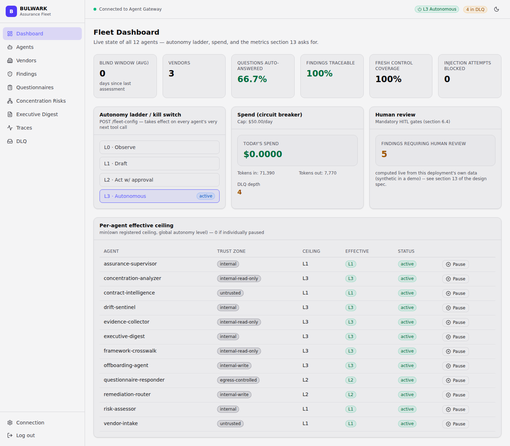

**Check:**
- Top bar reads **"Connected to Agent Gateway"** (green dot), not "Not
  connected."
- **12 agents** listed in the per-agent table at the bottom, each with a
  **Pause** button next to it.
- Autonomy ladder card shows **L3 &middot; Autonomous** highlighted as
  `active`.
- If any events are stuck, the **"N in DLQ"** badge (top right) is
  amber and clickable -- clicking it should land you on the DLQ page
  (see step 12). Zero DLQ entries means no badge at all, which is also
  correct.
- "Findings requiring human review" and "DLQ depth" tiles are links --
  click each and confirm they route to Findings / DLQ respectively,
  filtered where applicable.

## 3. Agents

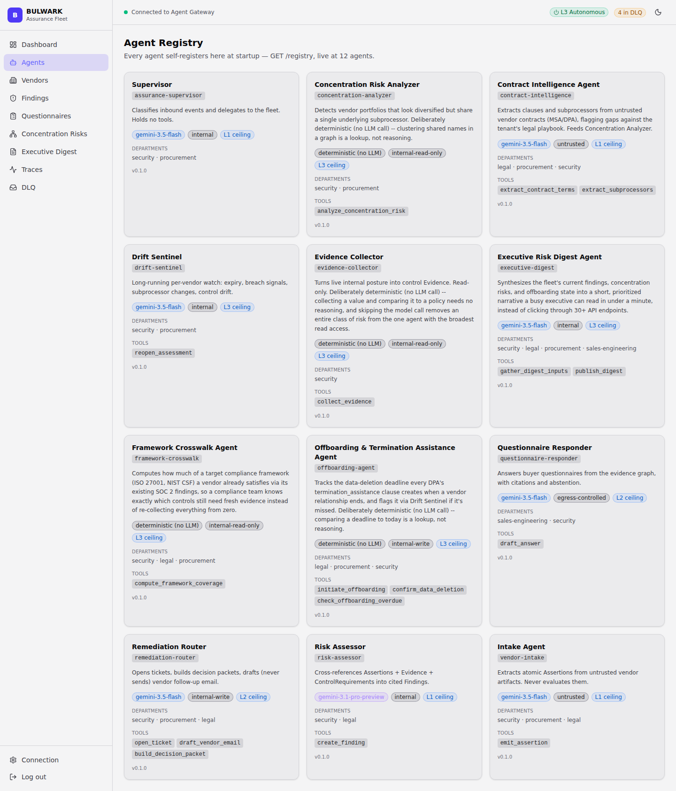

**Check:** every registered agent shows its trust zone, model (or "no
model" for the four deterministic agents), and autonomy ceiling. This is
the same 12-row set as the Dashboard's bottom table, just full-page.

## 4. Vendors

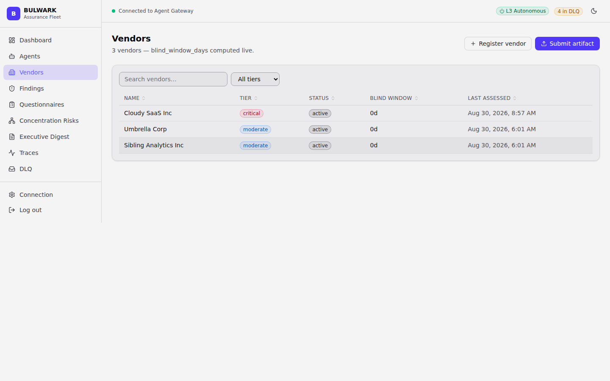

**Check:**
- Vendor count in the page subtitle matches the table's row count.
- **Tier** badges (`critical`/`moderate`/`low`) and **Blind window** column
  are populated, not blank.
- The **Search vendors...** box and **tier** filter actually filter the
  table -- type a partial vendor name and confirm the row count drops.
- **Submit artifact** (top right, primary button) opens the upload dialog
  -- this is the one flow that needs live Gemini credentials to complete;
  see [User Guide &sect;1](USER_GUIDE.md#1-onboarding-a-vendor-compliance-documents)
  for exact inputs if you're testing a real upload.

## 5. Vendor detail -- Findings tab

Click into any vendor row.

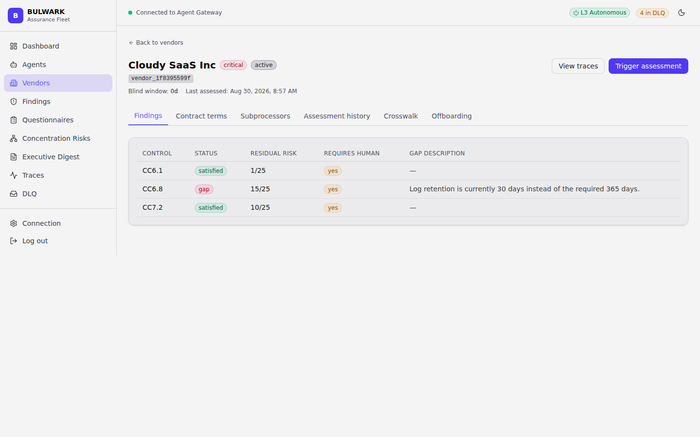

**Check:** six tabs across the top -- **Findings, Contract terms,
Subprocessors, Assessment history, Crosswalk, Offboarding**. Findings tab
is the default. Each row shows a control id, status, residual risk, and
(for gaps) a gap description in plain English, not a raw error string.

## 6. Vendor detail -- Contract terms

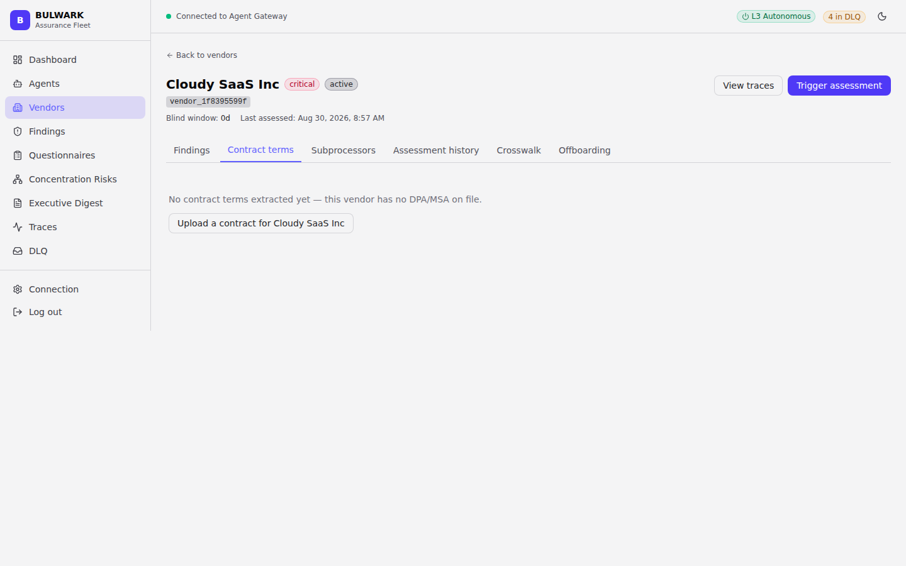

**Check:** populated only for vendors that have had a DPA/MSA processed by
Contract Intelligence -- an empty state here for a vendor that's never had
a contract uploaded is correct, not a bug.

## 7. Vendor detail -- Subprocessors

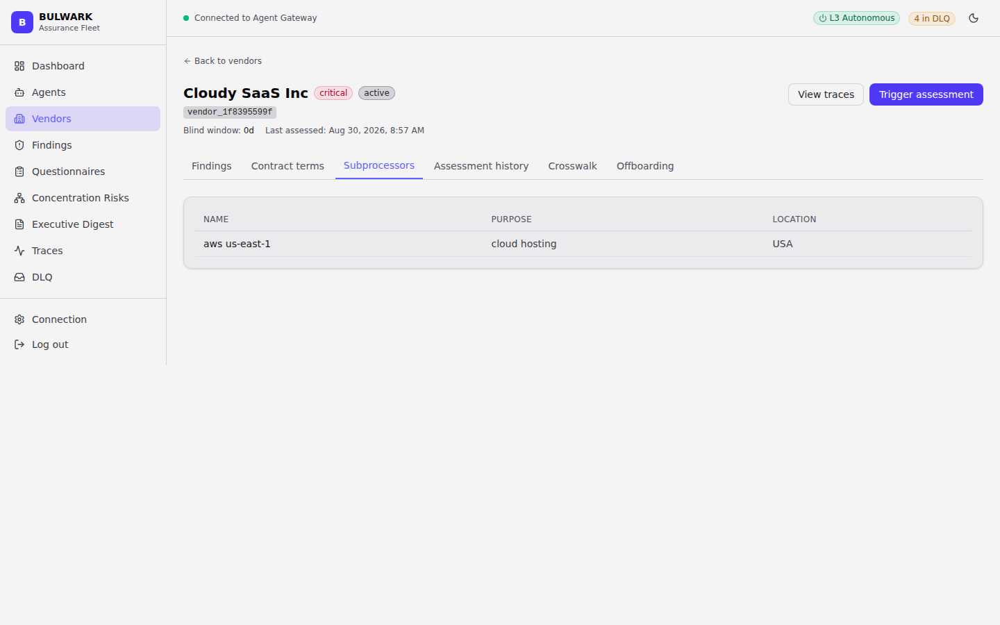

**Check:** this is the data Concentration Analyzer reads across every
vendor's subprocessor list to find shared-dependency risk (step 9).

## 8. Vendor detail -- Assessment history

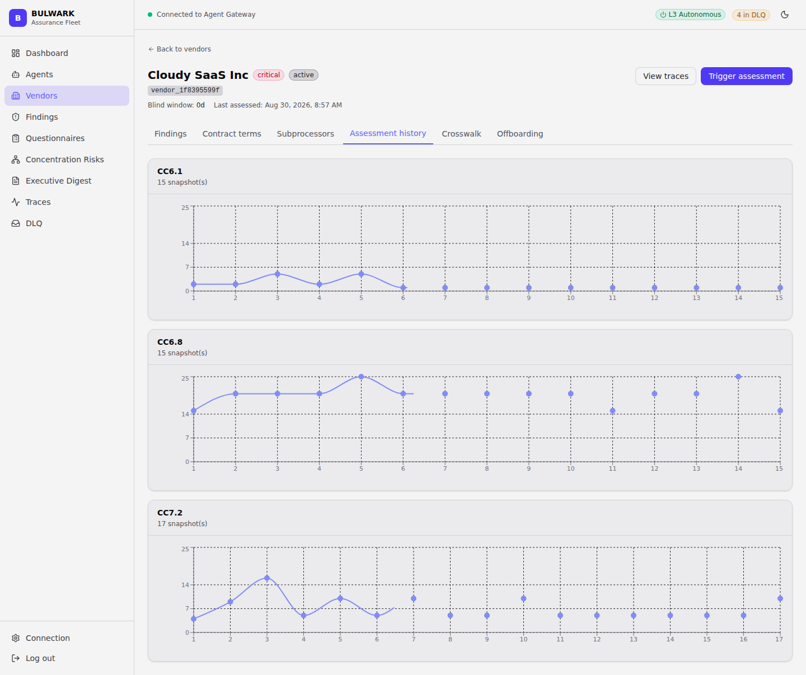

**Check:** one row per past reassessment, oldest first. This is what Drift
Sentinel's `risk_trend_rising` signal watches for a control getting worse
across reassessments, before it's a hard gap.

## 9. Vendor detail -- Crosswalk

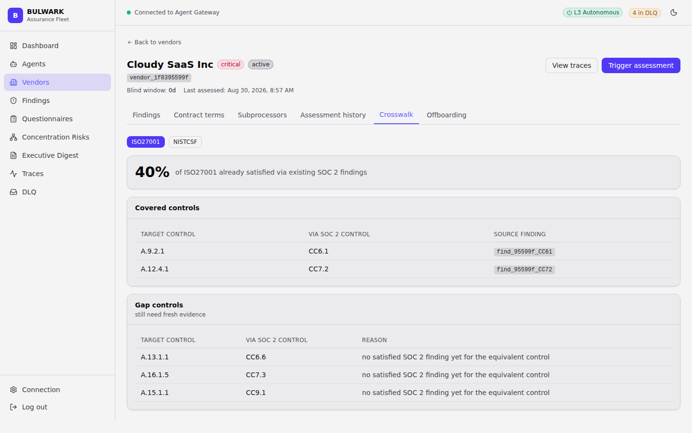

**Check:** a satisfied SOC 2 control should show its mapped ISO 27001 /
NIST CSF equivalents as already-covered, without a separate evidence
collection for those frameworks.

## 10. Vendor detail -- Offboarding

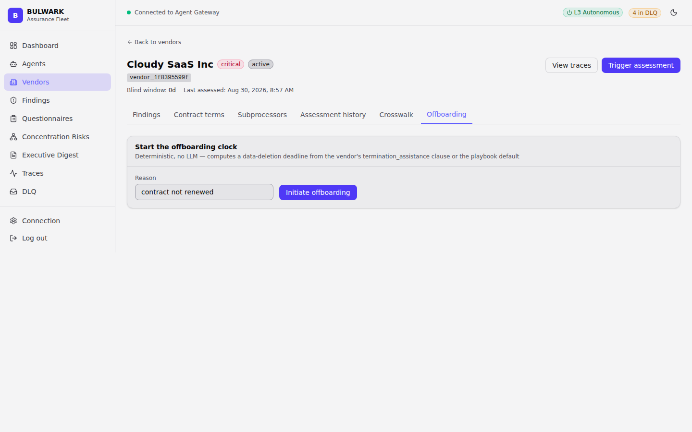

**Check:** for an active vendor with no offboarding in progress, this tab
should say so plainly rather than showing an empty table with no
explanation.

## 11. Findings (global)

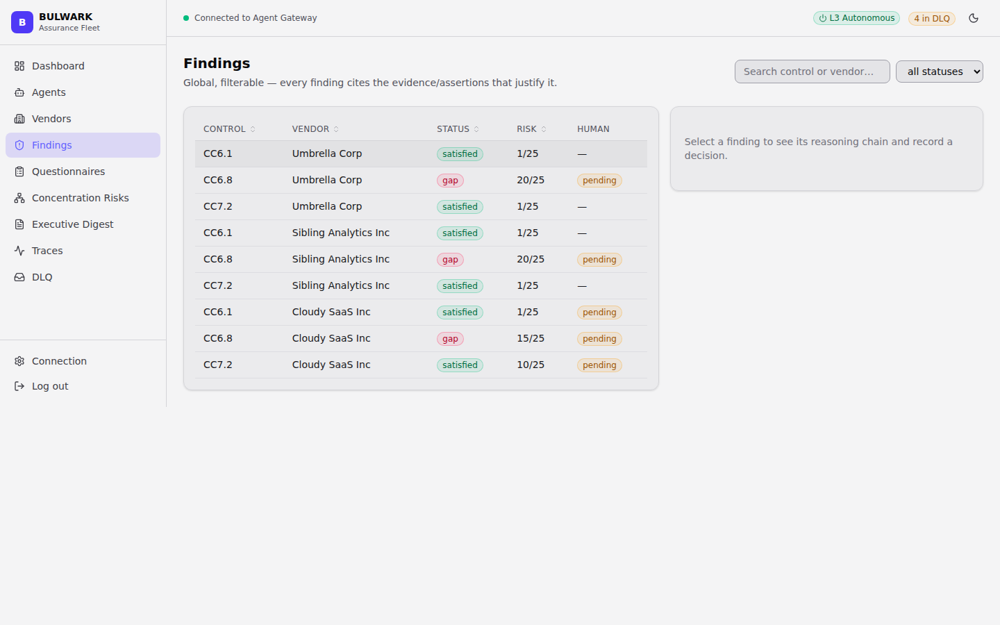

**Check:**
- Table is global across all vendors -- **Vendor** column shows vendor
  *names* (a clickable link to that vendor's detail page), never a raw
  `vendor_xxxxx` id.
- **Search control or vendor...** and the status dropdown filter the
  table live.
- Click any row -- the right-hand panel should populate with that
  finding's reasoning chain (see step 12) without a page navigation.

## 12. Finding detail + recording a decision

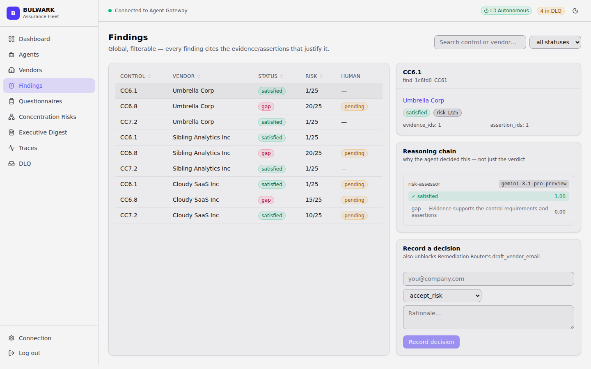

**Check:**
- **Reasoning chain** card shows the model used (e.g.
  `gemini-3.1-pro-preview` for Risk Assessor's judgment calls), the
  alternatives it weighed, and a score for each -- not just the final
  verdict.
- **Record a decision** form is present for findings with `human: pending`
  -- submitting it (email + decision type + rationale) should clear the
  pending flag. Per the mandatory HITL gates, this form should always be
  present for a `critical`-tier vendor's gap findings, never skippable.

## 13. Concentration Risks

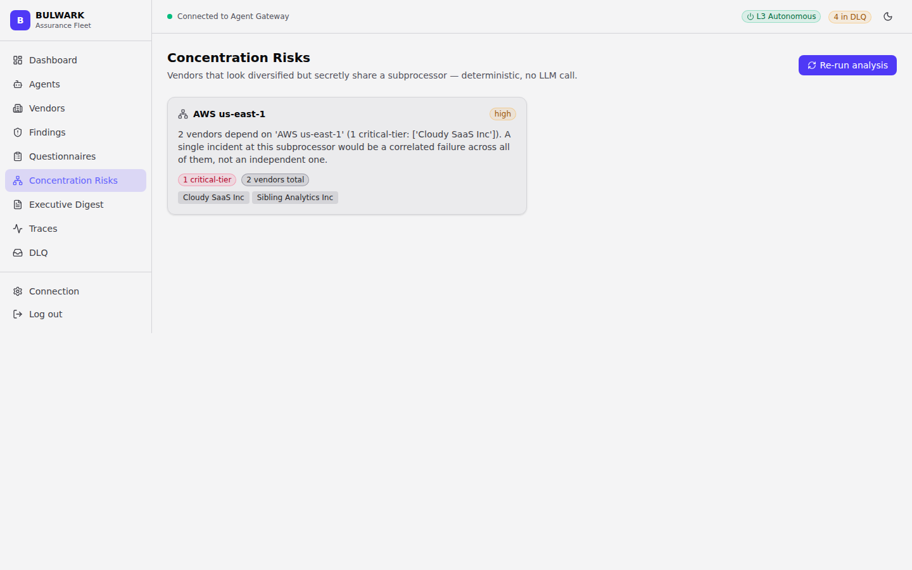

**Check:**
- Each card names a shared subprocessor, a risk tier (`high`/`medium`/
  `low`), and the vendor tags that share it -- tags are clickable links
  to each vendor's detail page.
- **Re-run analysis** re-scans the *entire* tenant's subprocessor graph
  (not just new records) -- if you've just uploaded a new contract for a
  vendor sharing an existing subprocessor, this button (or the automatic
  re-run that already fires after a contract is processed) is what makes
  it show up here.

## 14. Questionnaires

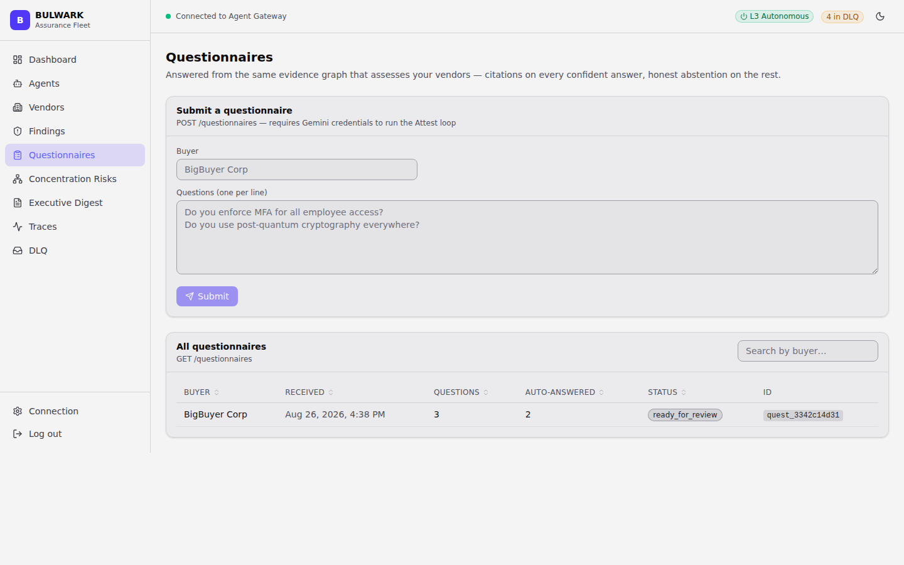

**Check:**
- Submitting a questionnaire (buyer name + one question per line) needs
  live Gemini credentials -- expect a clear error, not a silent failure,
  if credentials aren't configured.
- The table's **Auto-answered** column should be less than or equal to
  **Questions** -- the responder abstains honestly when it has no
  evidence, so 100% auto-answered isn't guaranteed and isn't a bug.

## 15. Executive Digest

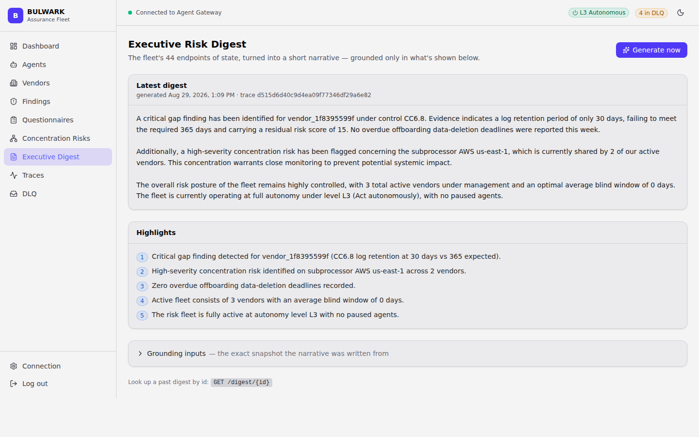

**Check:** narrative references vendors by **name**, never by raw
`vendor_xxxxx` id, and the generated-at timestamp is human-readable
(e.g. "Aug 30, 2026, 8:57 AM"), not a raw ISO string. This page needs
live Gemini credentials -- the narrative step is genuine model judgment,
not a template fill.

## 16. Traces

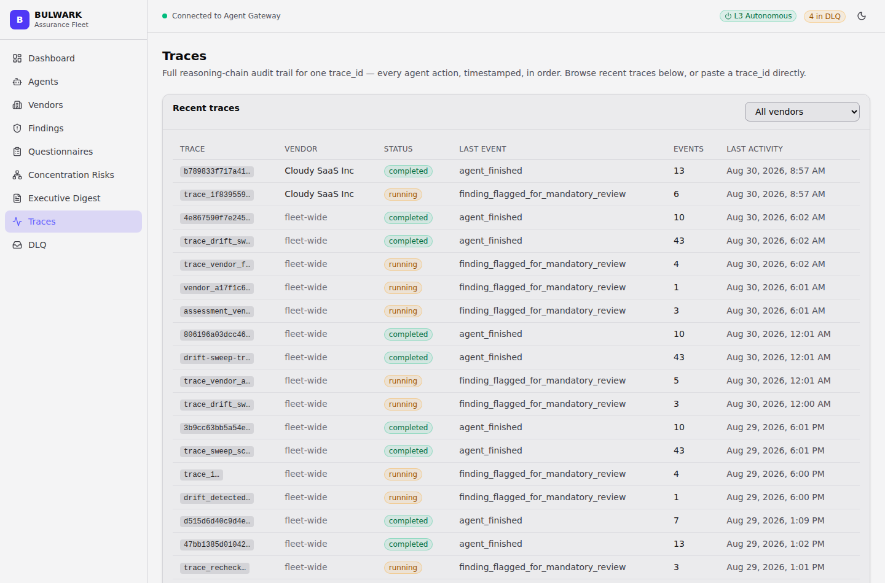

**Check:**
- **Recent traces** table is browsable without needing a `trace_id` in
  hand -- this is the fix for the old workflow that required copy-pasting
  a UUID from a `curl` response.
- The vendor dropdown (top right of the table) filters to just that
  vendor's traces.
- **Look up a trace_id directly** still works for anyone who does have one
  (e.g. from a finding-detail deep link).
- Clicking a row opens that trace's full reasoning-chain timeline,
  timestamped, in order.

## 17. Dead-Letter Queue (DLQ)

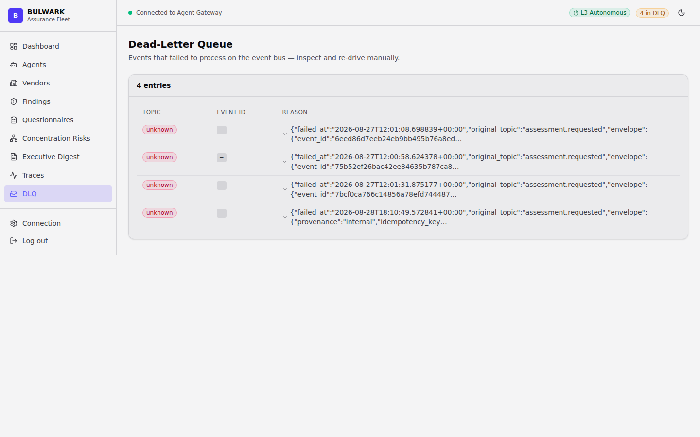

**Check:**
- Long or multi-line failure reasons collapse to one line by default,
  with a chevron to expand -- confirm a raw traceback doesn't blow out
  the whole page by default.
- Entry count in the header matches the "N in DLQ" badge you saw on the
  Dashboard.
- An empty DLQ (0 entries) should say so plainly, not show a blank table.

## 18. Settings / Connection

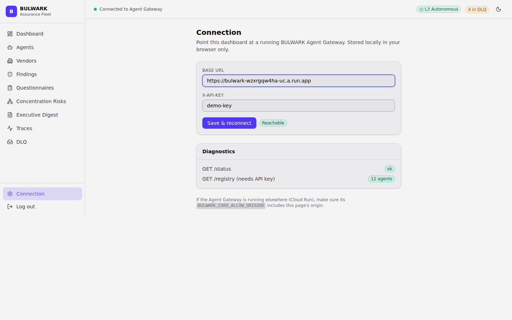

**Check:**
- **GET /status** diagnostic shows `ok` -- this is the app's own liveness
  route (deliberately not `/healthz`; see `src/bulwark/api/routes.py` for
  why Google Cloud Run's front-end infrastructure makes that path
  unusable).
- **GET /registry (needs API key)** shows **12 agents** -- if this fails
  while `/status` succeeds, the API key is wrong, not the connection.
- Changing Base URL / X-API-Key here is stored in this browser's
  `localStorage` only -- it doesn't change any server config, so it's
  safe to point at a different environment to test without redeploying
  anything.

---

## Quick smoke test (no UI, for CI or a pre-demo check)

If you just need a fast pass/fail before walking into a demo, the
`curl`-only version of steps 2, 4, 13, and 18 above:

```bash
BASE=https://your-deployment-url

curl -s "$BASE/status"
# expect: {"status":"ok"}

curl -s -H 'X-API-Key: demo-key' "$BASE/registry" | python3 -m json.tool
# expect: 12 agents

curl -s -H 'X-API-Key: demo-key' "$BASE/vendors" | python3 -m json.tool
# expect: your seeded vendors, each with a name and tier

curl -s -H 'X-API-Key: demo-key' "$BASE/concentration-risks" | python3 -m json.tool
# expect: at least the AWS us-east-1 risk from seed_demo_data.py
```

If all four come back clean, the backend is healthy and the dashboard
should load without the "Not connected" banner.
