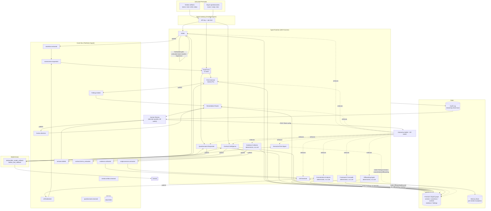

# Architecture

BULWARK is a twelve-agent fleet for the **Fortified Enterprise Fleet**
track: continuous third-party assurance built on an event-driven Agent
Runtime, a shared control-evidence graph, per-agent zero-trust identity,
Model Armor guardrails at every untrusted boundary, and a live kill
switch. Seven agents implement the spec's Onboard/Watch/Attest loops;
five more -- Contract Intelligence, Concentration Analyzer, Framework
Crosswalk, the Offboarding Agent, and Executive Risk Digest -- go past
the spec to attack real enterprise pain no per-vendor checklist review
can reach: manual contract/DPA review, the hidden portfolio risk of
vendors that look diversified but secretly share a subprocessor, the
redundant evidence collection enterprises repeat across every
overlapping compliance framework they carry, the DPA-mandated
data-deletion deadline every vendor termination creates that otherwise
lives in a spreadsheet if it's tracked at all, and the 30+ API endpoints
of fleet state nobody has time to click through every week. Drift
Sentinel additionally gained a fifth signal --
`offboarding_overdue` -- and a fourth, predictive one --
`risk_trend_rising` -- that flags a control's residual risk climbing
across consecutive reassessments before any single one crosses a hard
gap threshold (see "Beyond the spec" below).

## System diagram

## The twelve agents

| # | Agent | Model | Trust zone | Ceiling | Why |
|---|---|---|---|---|---|
| 1 | Supervisor | Flash | internal | L1 | Classifies an internal-provenance event and delegates via ADK's native sub-agent transfer. Holds **no tools** -- nothing to compromise. |
| 2 | Intake | Flash | **untrusted** | L1 | The only agent that reads vendor-supplied documents. Extraction is claim-only: it can never write a finding, only an Assertion. |
| 3 | Evidence Collector | **none** | internal, read-only | L3 | Deliberately deterministic -- comparing an observed value to a policy is a lookup, not reasoning, so it costs zero tokens and has no prompt-injection surface at all. |
| 4 | Risk Assessor | **Pro** | internal | L1 | The one step that's genuine complex judgment (per the hackathon's own cost guidance: reserve Pro for that, not for rubber-stamping). Also the write path for `AssessmentSnapshot`'s append-only history -- see "Beyond the spec" below. |
| 5 | Questionnaire Responder | Flash | egress-controlled | L2 | Answers with citations; abstains below a confidence threshold; every answer passes a DLP-style scan before it's marked exportable. |
| 6 | Drift Sentinel | Flash | internal | L3 | Long-running, checkpointed sweeps; reopening an assessment is fully reversible, which is what justifies L3 (autonomous). Its fourth signal, `risk_trend_rising`, is predictive rather than reactive, and its fifth, `offboarding_overdue`, is a hardcoded guard against clobbering an offboarding vendor's status -- see "Beyond the spec" below. |
| 7 | Remediation Router | Flash | internal-write | L2 | Opens tickets and builds decision packets freely; drafting vendor email requires a **recorded human decision already existing on the finding** -- checked in code, not by policy level alone -- and there is no `send_email` function anywhere in this codebase. |
| 8 | Contract Intelligence | Flash | **untrusted** | L1 | The second (and only other) agent that reads vendor-supplied documents -- MSAs/DPAs carry the same injection threat model as a SOC 2 report, so it gets the identical trust zone and Model Armor gate as Intake. Extracts clauses against a legal playbook and flags deviations (liability caps, breach-notification windows, audit rights, subprocessor flow-down, ...) instead of a paralegal re-deriving them by hand. |
| 9 | Concentration Analyzer | **none** | internal, read-only | L3 | Deliberately deterministic, same reasoning as Evidence Collector -- clustering subprocessor names shared across vendors is a graph lookup, not judgment. Catches the portfolio-level blind spot no single-vendor review can: multiple "independently diversified" vendors secretly depending on the same subprocessor, the pattern behind incidents like the 2024 CrowdStrike outage. |
| 10 | Framework Crosswalk | **none** | internal, read-only | L3 | Deliberately deterministic -- mapping a control to its equivalent in another framework is a table lookup, not judgment. Reports how much of a target framework (ISO 27001, NIST CSF) a vendor already satisfies via its existing SOC 2 findings, cutting redundant evidence collection across overlapping frameworks. |
| 11 | Offboarding Agent | **none** | internal-write | L3 (init/detect) / L2 (confirm) | Deliberately deterministic -- computing a deadline and comparing it to today is arithmetic, not judgment. Tracks the data-deletion clock every DPA's `termination_assistance` clause creates; `confirm_data_deletion` is gated one rung lower (L2) since it closes out a compliance obligation, not something that should be silently reversible. |
| 12 | Executive Risk Digest | Flash | internal | L3 (gather) / L1 (publish) | `gather_digest_inputs` is a deterministic read (L3, same shape as Framework Crosswalk's own analysis); the narrative synthesis itself is genuine LLM judgment, so `publish_digest` stays at L1 (Draft) -- a human-readable summary, not an autonomous action on anything. |

Full per-agent resource grants (the zero-trust table) are in
`platform/identity.py`; the registry entries with versions and
department tags are in `platform/registry.py`.

## Event topics (section 4.2)

| Topic | Producer | Consumer | This build |
|---|---|---|---|
| `vendor.artifact.received` | Agent Gateway | Intake | `agents/orchestrator.py::process_vendor_artifact` |
| `assertion.extracted` | Intake | (routes to `assessment.requested`) | `orchestrator._on_assertion_extracted` |
| `assessment.requested` | Supervisor / Sentinel / API / Gateway | Risk Assessor | `orchestrator._on_assessment_requested` |
| `finding.created` | Risk Assessor | Remediation Router | `orchestrator._on_finding_created` |
| `drift.detected` | Drift Sentinel | Supervisor (via `assessment.requested`) | `orchestrator._on_drift_detected` |
| `questionnaire.received` | Agent Gateway | Questionnaire Responder | `orchestrator.submit_questionnaire` |
| `evidence.collected` | Evidence Collector | Drift Sentinel | `orchestrator._on_evidence_collected` -- runs the same `run_drift_sweep` the scheduled tick uses |
| `answer.drafted` | Questionnaire Responder | Human review queue | published with `{questionnaire_id, auto_pct, abstain_count}`; no further automated reaction |
| `human.decision` | HITL (`POST /findings/{id}/decision`, `POST /decisions`) | Remediation Router | `orchestrator._on_human_decision` -- this is what lets `draft_vendor_email`'s human-decision gate actually pass |
| `contract.terms_extracted` | Contract Intelligence | (documented, no automated consumer in this build) | published with `{vendor_id, artifact_id}`; a natural extension routes high/critical-risk deviations into Remediation Router the same way `finding.created` does, left out to keep this addition well-scoped |
| `subprocessors.extracted` | Contract Intelligence | Concentration Analyzer | `orchestrator._on_subprocessors_extracted` -- re-runs the full-portfolio cluster check on every new disclosure |
| `*.dlq` | (all) | `GET /dlq` | handled generically by `platform/event_bus.py`, not as separate named topics -- see that module's docstring |

Every publish above uses `platform/event_bus.py`'s `Envelope` (event_id,
idempotency_key, trace_id, provenance, tenant, region_pin, attempt,
payload) exactly as section 4.2 specifies.

## The three loops, as actually wired

**Onboard** (`agents/orchestrator.py`): `POST /vendors/artifacts` →
`prescan_artifact` (deterministic Model Armor scan) → if blocked, stop
here, before any LLM call → if clean, Intake extracts Assertions →
publish `assertion.extracted` → republish `assessment.requested` →
Supervisor transfers to Risk Assessor → `create_finding` (citation
validation gate) → publish `finding.created` → Remediation Router opens a
ticket + decision packet.

**Watch** (`agents/drift_sentinel.py`): `POST /drift-sentinel/tick`
(Cloud Scheduler in production) → `run_drift_sweep` checks artifact
expiry, evidence drift, a mock breach feed, and a control's residual risk
rising for three consecutive reassessments (all skipping controls
covered by an active Memory Bank exception), checkpointing progress via
the Run ledger → Drift Sentinel judges severity and calls
`reopen_assessment` → publishes `drift.detected` → orchestrator
republishes `assessment.requested` for every affected vendor, with no
human or API call in between.

**Attest** (`agents/questionnaire_responder.py`): `POST /questionnaires`
→ Supervisor transfers to Questionnaire Responder → `search_evidence`
(stands in for Vertex AI Vector Search) grounds each answer → `draft_answer`
gates on confidence *and* a DLP-style scan before marking an answer `auto`.

**Assure** (`agents/contract_intelligence.py`, `agents/concentration_analyzer.py`):
`POST /vendors/artifacts` with `doc_type` one of `msa`/`dpa`/`contract`/
`sla`/`order form` → same `prescan_artifact` Model Armor gate as
Onboard → routes to Contract Intelligence instead of Intake →
`extract_contract_terms` flags playbook deviations → `extract_subprocessors`
publishes `subprocessors.extracted` → Concentration Analyzer re-clusters
every subprocessor in the tenant's portfolio by normalized name and
supersedes its prior `ConcentrationRisk` records with current state, with
no human or API call in between.

**Offboard** (`agents/offboarding.py`): `POST /vendors/{id}/offboard` →
`initiate_offboarding` sets `vendor.status = "offboarding"` and computes a
data-deletion deadline from the vendor's own extracted
`termination_assistance` clause (or the playbook default) → Drift
Sentinel's sweep calls `check_offboarding_overdue` deterministically on
every tick, same as its other three detection steps → a miss surfaces as
an `offboarding_overdue` signal through the same LLM-judgment path every
other Drift Sentinel signal uses, guarded so it never reopens an
already-offboarding vendor into `under_review` → `POST
/vendors/{id}/offboard/confirm` closes it out, terminal, not reversible.

**Digest** (`agents/executive_digest.py`): `POST /digest/generate` (or a
weekly Cloud Scheduler cadence) → `gather_digest_inputs` deterministically
pulls the week's most urgent state across every other agent's output →
the LLM writes a 3-5 paragraph prioritized narrative grounded only in
those inputs → `publish_digest` persists it → `GET /digest/latest`
serves it without re-running anything.

No agent module imports another agent module anywhere in this codebase.
Every handoff above is `bus.publish`/`bus.subscribe` on a named topic;
`tests/test_orchestrator_wiring.py` asserts this mechanically, not just
in the diagram.

## Mechanisms worth reading in the code directly

**The citation-validation gate** (`agents/risk_assessor.py`,
`create_finding`): a finding with zero `evidence_ids`/`assertion_ids`, or
a citation to an id that doesn't actually exist in the graph, is rejected
by a post-processor before it's ever persisted -- deterministic code, not
a prompt telling the model to behave. `tests/test_agents_tools.py`
exercises both rejection paths directly.

**The kill switch** (`platform/policy.py`): `POST /fleet-config` with
`{"autonomy_level": 0}` and every L1+ tool call across all twelve agents
starts raising `AutonomyBlocked` on its very next invocation -- no
redeploy, no restart, checked against `platform/models.py`'s
`fleet_config` singleton on every single tool call. `POST
/fleet-config {"pause_agent_id": "drift-sentinel"}` does the same for one
agent without touching the rest of the fleet. This is meant to be
demonstrated live, not just described.

**The circuit breaker** (`platform/spend.py`): every ADK Runner call in
`orchestrator._run` extracts real `usage_metadata` (prompt/candidate
token counts) off the event stream, accumulates them into a daily
`SpendLedger`, and calls `check_circuit_breaker()` -- which, on breach of
`fleet_config.max_daily_token_spend`, calls the exact same
`set_global_autonomy(0)` the manual kill switch uses. "Breach -> all
agents drop to L0" (section 8) is one function call, not a separate code
path that could drift from the kill switch's actual behavior. The
per-1K-token dollar rates are illustrative placeholders (labeled as such
in the module docstring) -- what's real is the mechanism, not the number.

**Rollback** (`platform/rollback.py`): the genuinely reversible L3
actions -- `reopen_assessment` (Drift Sentinel), `open_ticket`
(Remediation Router), and `initiate_offboarding` (Offboarding Agent) --
each write a `CompensatingAction` record (before value, after value)
before returning. `confirm_data_deletion` deliberately does not: it
certifies a real-world fact (the vendor's data is actually gone), and a
rollback that flipped a database field back wouldn't undo that, so
pretending it's reversible would be dishonest about what "rollback"
means in this system. `POST /runs/{trace_id}/rollback`
replays a trace's compensating actions most-recent-first, restores each
field, and marks them rolled back (idempotent -- replaying twice is a
no-op the second time). The grouping key is `trace_id`, not a Drift
Sentinel `Run`'s own `run_id`; see the module docstring for why.

**Mandatory human-in-the-loop gates** (section 6.4): three of the four
are enforced in `agents/risk_assessor.py::create_finding`, all setting
`Finding.requires_human = True` regardless of the current autonomy
level -- (1) evidence cited as "satisfied" that's actually stale gets the
status itself downgraded to `"unknown"` (section 10's exact fail-closed
example), (2) any finding on a `tier="critical"` vendor
(`platform/policy.py::requires_mandatory_human_review`), (3) any finding
with `residual_risk >= RESIDUAL_RISK_HUMAN_THRESHOLD` (default 15/25).
The fourth -- any outbound external communication -- is
`agents/remediation_router.py::draft_vendor_email`'s refusal to run
without a `Finding.human_decision` already recorded, which is also the
only place in this codebase capable of producing vendor-facing text; a
`send_email` function does not exist, so "never sends autonomously" isn't
a policy check a future change could loosen.

**The reasoning-chain record and `/explain`** (section 7):
`create_finding` also persists a `ReasoningRecord` -- every status it
weighed, a 0.0-1.0 score per option, `why_not` on each one it didn't
pick, `chosen: true` on the one it did, plus an `inputs_hash` and (once
`orchestrator._run` finishes and stamps real telemetry onto it)
`model`/`tokens_in`/`tokens_out`/`latency_ms`. `GET
/findings/{id}/explain` replays it alongside the finding itself -- "why
did the agent decide this" gets a straight, structured answer, not a
re-run.

**Data sovereignty** (`platform/models.py::TenantRepo`, section 6.3): a
tenant's `region_pin` is recorded and echoed on every event Envelope, but
per the spec's own explicit guidance the actual enforcement is an
Organization Policy (`gcp.resourceLocations`) binding set outside
application code -- `region_pin_matches` is an advisory app-level check
an operator could alert on, not the control itself. Deliberately not
over-built: an auditor should be able to verify this independently of
anything this codebase does.

## Beyond the spec

The seven agents in the first table implement the spec as written. The
capabilities below solve real enterprise pain the spec doesn't ask for
but that standard per-vendor third-party review structurally can't
catch:

**Contract Intelligence** (`agents/contract_intelligence.py`): manual
MSA/DPA review against a legal playbook is one of the most expensive,
most manual bottlenecks in enterprise procurement -- a paralegal or
general counsel reading every contract by hand for a liability cap, a
breach-notification window, subprocessor flow-down language, audit
rights. `extract_contract_terms` does that comparison automatically
against `agents/contract_playbook.py` (explicitly labeled illustrative
reference data, same pattern as this project's other mock datasets) and
flags the gap as a structured `ContractTerm` instead of a manual
re-derivation. `GET /vendors/{id}/contract-terms` surfaces the result;
filter client-side on a non-empty `deviation` for just the flagged ones.

**Concentration Analyzer** (`agents/concentration_analyzer.py`): standard
review is per-vendor -- each SOC 2 or contract comes back looking fine in
isolation. What that misses is *portfolio* risk: if a dozen vendors that
look independently diversified all secretly run on the same
subprocessor (the same cloud region, the same auth provider), a single
incident there becomes a correlated failure across all of them at once
-- structurally invisible to any tool that only ever looks at one vendor
at a time. This is the exact blind spot behind real incidents like the
2024 CrowdStrike outage cascading through supposedly-independent
downstream vendors. `analyze_concentration_risk` clusters every
subprocessor `agents/contract_intelligence.py` has ever extracted by
normalized name, flags every cluster touching 2+ vendors, and weights
severity by how many of them are critical-tier -- re-running always
supersedes stale clusters rather than accumulating duplicates. `POST
/concentration-analyzer/tick` triggers it manually; it also runs
automatically off every `subprocessors.extracted` event. `GET
/concentration-risks` lists current clusters, ranked by how many
critical-tier vendors are exposed.

**Risk trend early-warning** (`agents/drift_sentinel.py`'s fourth signal,
`risk_trend_rising`; `platform/models.py::AssessmentSnapshot`): `Finding`
is keyed by vendor+control and overwritten in place on every
reassessment -- deliberately, since the finding itself should always
show current state, not a growing pile of stale ones. But that means, on
its own, the fleet has no way to see a *trajectory*: a control whose
residual risk climbs 4 -> 9 -> 16 across three sweeps looks, at every
individual point, like just another gap finding, with nothing connecting
the three into a pattern a human should notice before it gets worse.
`create_finding` now also appends an immutable `AssessmentSnapshot` on
every call (never overwritten, unlike `Finding`), and `run_drift_sweep`'s
new step scans for three consecutive strictly-rising snapshots on the
same vendor+control -- suppressed the same way every other signal is by
an active Memory Bank exception -- and raises `risk_trend_rising` through
the exact same LLM-judgment -> `reopen_assessment` path every other
signal already uses. This is what turns the fleet from purely reactive
(you have a gap) to predictive (you're trending toward one), using the
same weeks-of-persistence machinery the Fortified Enterprise Fleet track
already requires Memory Bank to provide. `GET
/vendors/{id}/assessment-history` exposes the raw trail for inspection or
charting.

**Framework Crosswalk** (`agents/framework_crosswalk.py`,
`agents/framework_crosswalk_reference.py`): enterprises rarely carry just
one compliance framework -- SOC 2 for one buyer, ISO 27001 for a European
one, NIST CSF for a federal one -- and standard tooling re-collects
evidence for each framework independently, multiplying audit fatigue
linearly with framework count. `compute_framework_coverage` doesn't
re-collect anything: it looks at Findings Risk Assessor has *already*
produced for a vendor's SOC 2 controls and reports, per an illustrative
control-equivalence crosswalk (explicitly labeled as such, same pattern
as `contract_playbook.py`), which controls in a target framework are
already indirectly satisfied versus which ones genuinely still need
fresh evidence -- each covered entry citing the source `finding_id`, so
the coverage claim is traceable, not just a percentage. `GET
/vendors/{id}/crosswalk?target_framework=ISO27001` exposes it.

**Offboarding & termination assistance** (`agents/offboarding.py`):
`VendorStatus` has carried an `"offboarding"` value since the very first
version of this schema, but until now no code path ever set or cleared
it -- a documented gap. Every DPA this fleet reviews contains a
`termination_assistance` clause obligating the vendor to export data and
certify its deletion within a fixed window; in practice that obligation
is tracked in a spreadsheet, if at all. `initiate_offboarding` starts the
clock -- using the vendor's own contracted deadline if Contract
Intelligence flagged one as a deviation from the playbook default, so the
two agents' work compounds rather than duplicates -- `confirm_data_deletion`
stops it, and Drift Sentinel's fifth signal (`offboarding_overdue`) is
what actually surfaces a miss: a vendor still holding your data past the
date they were contractually required to delete it, a real,
auditable data-retention and GDPR/CCPA exposure. `GET
/vendors/{id}/offboarding` exposes the current record.

**Executive Risk Digest** (`agents/executive_digest.py`): this build's API
surface grew to 44 routes across five feature areas: nobody clicks
through all of them weekly, so an urgent item (a critical-tier gap, a
newly-detected concentration risk, an overdue offboarding) can sit
unnoticed for a full review cycle. `gather_digest_inputs` deterministically
pulls the week's most urgent state across every other agent's output in
one call; the LLM then writes a 3-5 paragraph narrative that prioritizes
by urgency and is instructed never to invent a figure not present in
those inputs, and `publish_digest` persists it alongside the exact inputs
it was grounded in, so a claim in the digest can always be checked
against what the model actually saw.

All six of the above follow the same design rules as the rest of the
fleet: Contract Intelligence gets Intake's identical untrusted-zone grant
shape (it reads the same class of vendor-supplied, attacker-adjacent
documents); Concentration Analyzer, Framework Crosswalk, and the
Offboarding Agent get Evidence Collector's identical deterministic,
no-LLM, L3 shape (clustering names, looking up a control's equivalent, or
comparing a deadline to today is a lookup, not judgment, so all three
cost zero tokens and carry zero prompt-injection surface); the risk-trend
and offboarding-overdue signals reuse Drift Sentinel's existing identity,
registry entry, and LLM-judgment step rather than standing up a redundant
agent for what is, architecturally, just a fourth and fifth kind of
drift; Executive Risk Digest splits its own two tools the same
deterministic-gather/LLM-judgment way Risk Assessor's finding pipeline
does, just compressed into one agent.

## API surface (section 9)

Every route below lives in `api/routes.py`, behind the Agent Gateway's
API-key + rate-limit check (`_authorize`).

| Route | Purpose |
|---|---|
| `POST /vendors` | Register a vendor and set its tier up front |
| `POST /vendors/artifacts` | Upload (JSON `raw_text`) → quarantine-scan → Model Armor → extract |
| `POST /vendors/artifacts/upload` | Same pipeline, but a real file (PDF/DOCX/TXT, multipart) -- text extraction happens at the HTTP edge (`api/document_extraction.py`) before Model Armor ever sees it |
| `GET /vendors` / `GET /vendors/{id}` | List / fetch, with `blind_window_days` computed live |
| `GET /vendors/{id}/findings` | Findings for one vendor |
| `GET /vendors/{id}/contract-terms` | Extracted clauses for one vendor's contract(s), each pre-evaluated against the playbook |
| `GET /vendors/{id}/subprocessors` | Subprocessors disclosed in one vendor's contract(s) |
| `GET /vendors/{id}/assessment-history` | Append-only trend of every reassessment ever recorded, not just current state |
| `GET /vendors/{id}/crosswalk?target_framework=` | Coverage of a target compliance framework via the vendor's existing SOC 2 findings |
| `POST /vendors/{id}/offboard` | Start the offboarding clock -- sets `vendor.status = "offboarding"`, computes a data-deletion deadline |
| `POST /vendors/{id}/offboard/confirm` | Close out an offboarding -- sets `vendor.status = "offboarded"`, terminal |
| `GET /vendors/{id}/offboarding` | Current `OffboardingRecord` for one vendor |
| `POST /assessments` | Manually (re-)trigger an assessment |
| `GET /assessments/{trace_id}` | Status + checkpoint position for a triggered assessment |
| `GET /findings` `?status=gap` | Global, filterable findings listing |
| `GET /findings/{id}` | Fetch one finding |
| `GET /findings/{id}/explain` | Replay its reasoning-chain record(s) |
| `POST /findings/{id}/decision` / `POST /decisions` | Record a human decision (path- or body-keyed) |
| `POST /questionnaires` | Upload/submit a buyer questionnaire |
| `GET /questionnaires/{id}` | Answers + confidence + citations |
| `POST /questionnaires/{id}/export` | DLP-gated export (only `auto`-status answers) |
| `POST /runs/{trace_id}/rollback` | Compensating-action rollback |
| `POST /evidence-collector/tick` | Deterministic sweep -- no credentials needed |
| `POST /drift-sentinel/tick` | Scheduled/manual drift sweep |
| `POST /concentration-analyzer/tick` | Deterministic full-portfolio subprocessor-cluster sweep -- no credentials needed |
| `GET /concentration-risks` | Current concentration-risk clusters, ranked by critical-tier vendor exposure |
| `POST /digest/generate` | Run the Executive Risk Digest Agent now, rather than waiting for the next scheduled run |
| `GET /digest/latest` | The most recently generated digest |
| `GET /digest/{id}` | Fetch one digest by id |
| `GET /traces` | Browse recent trace summaries -- optionally `?vendor_id=` scoped -- instead of needing a trace_id already in hand |
| `GET /traces/{id}` | Full reasoning-chain audit trail for a trace |
| `GET /dlq` | Dead-letter queue contents |
| `GET /fleet-config` / `POST /fleet-config` | Kill switch: read/set autonomy level, pause/resume an agent |
| `GET /fleet/health` | Per-agent effective ceiling, DLQ depth, today's spend |
| `GET /metrics` | Section 13's dashboard numbers, computed live |
| `GET /registry` | The Agent Registry listing |

## GCP + GEAP service mapping

| Need | Service | This build |
|---|---|---|
| Agent hosting | Cloud Run | `deploy/deploy_cloud_run.sh`, min-instances=0 |
| Discovery/versioning | Agent Registry | `platform/registry.py`, live -- `GET /registry` |
| Long-running async execution | Agent Runtime | `platform/models.py` `RunRepo` (checkpointing), live |
| Cross-session memory | Memory Bank | `platform/memory_bank.py`, live |
| Zero-trust access | Agent Identity | `platform/identity.py`, live |
| Routing + policy | Agent Gateway | `api/routes.py` + `platform/auth.py`, live |
| Guardrails | Model Armor | `platform/guardrails.py`, live |
| Audit + reasoning traces | Agent Observability | `platform/observability.py` (OTel spans + `GET /traces/{id}`), live |
| Event bus | Pub/Sub | `platform/event_bus.py`: in-process dispatch always live; mirrors to real Pub/Sub topics when `USE_PUBSUB=true` against topics `deploy/setup_gcp.sh` provisions |
| Graph state | Firestore | `platform/store.py`: in-memory by default, Firestore-backed when `GOOGLE_CLOUD_PROJECT` is set |
| Evidence retrieval | Vertex AI Vector Search | represented by `questionnaire_responder.search_evidence`'s substring match -- documented as a stand-in, see README |
| Audit warehouse | BigQuery | documented target for the audit log; not wired to a live BigQuery table in this build (no GCP project to verify against) |
| Egress inspection | Cloud DLP | represented by `guardrails.scan_for_dlp_violation` -- documented as a stand-in, see README |
| Cadence | Cloud Scheduler | `deploy/deploy_cloud_run.sh` provisions both sweep jobs against the live Cloud Run URL |
| Secrets | Secret Manager | `remediation-router`'s identity grant (`platform/identity.py`) declares `secrets:read`; no ticket-system credential actually needs fetching in this build (tickets are mocked), so there is no live Secret Manager call to point at -- the grant exists so the shape is right when a real Jira/GitHub integration is added |
| Data sovereignty | Org Policy (`gcp.resourceLocations`) | `platform/models.py::TenantRepo` records `region_pin`; actual enforcement is the Org Policy binding, per section 6.3's own guidance, not application code |

## Composite indexes (production Firestore)

`findings(vendor_id, status, residual_risk desc)` ·
`evidence(control_ref, collected_at desc)` ·
`artifacts(valid_until asc)` ·
`answers(status, confidence asc)`

The in-memory backend used for local dev and tests doesn't need indexes
(it's a linear scan over a dict); these apply once `USE_FIRESTORE=true`.
